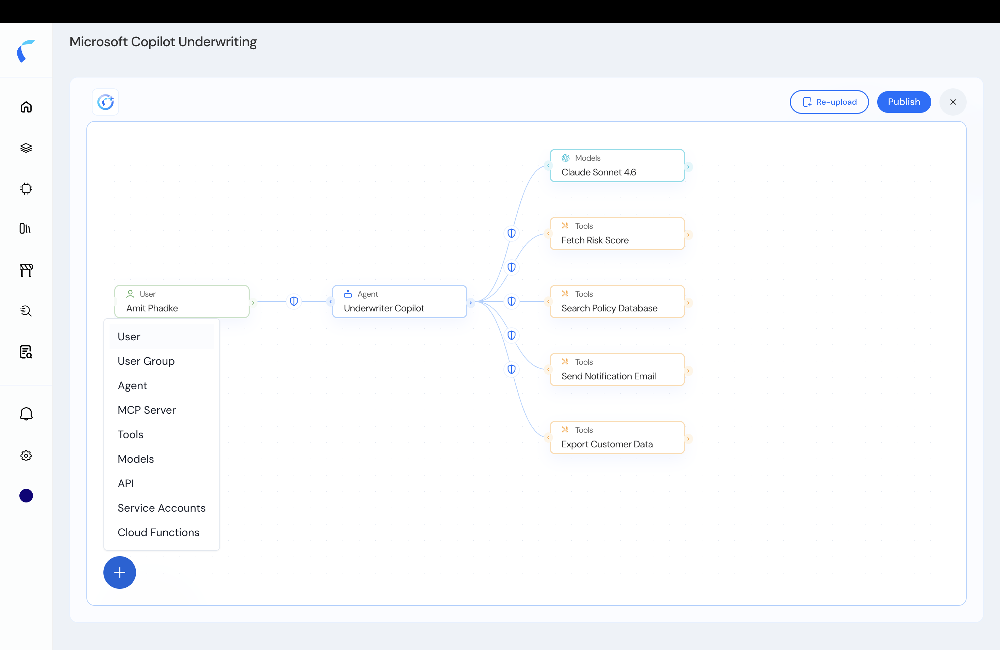

You can start from a **blank topology** or extend an existing one — adding entities by hand and wiring their connections. This is useful when you're modeling a system Reva hasn't discovered.

<Steps>
  <Step title="Open the topology and click +">
    On the topology canvas, click **+** to add an entity.

    <Frame caption="Add an entity on the topology canvas.">
      
    </Frame>
  </Step>
  <Step title="Pick the entity type">
    Choose the entity type — **User**, **Agent**, **Tool**, **MCPServer**, **Model**, or **API**. The new node appears on the canvas.
  </Step>
  <Step title="Connect it yourself">
    Reva doesn't know your topology, so **you draw the connections** — wire the new node to the agents, tools, or models it interacts with. Only valid source → target edges are allowed (for example, only an `Agent` can invoke a `Model`).
  </Step>
  <Step title="Write policies and publish">
    Add policies on the new edges (see [Policy Design](/ai-workload-policy-design)), then **Publish**.
  </Step>
</Steps>

<Note>
  Reva validates connections against the agentic model — see the legal source → target edges in [Context Modeling](/ai-workload-context-modeling#entity-relationships--topology).
</Note>

## Related

<CardGroup cols={2}>
  <Card title="View & Edit Entity Details" icon="pen-to-square" href="/ai-workload-entity-detail">
    Refine an entity's attributes after adding it.
  </Card>
  <Card title="Upload from Template" icon="file-arrow-up" href="/ai-workload-schema-upload-template">
    Bootstrap many entities at once instead.
  </Card>
</CardGroup>
