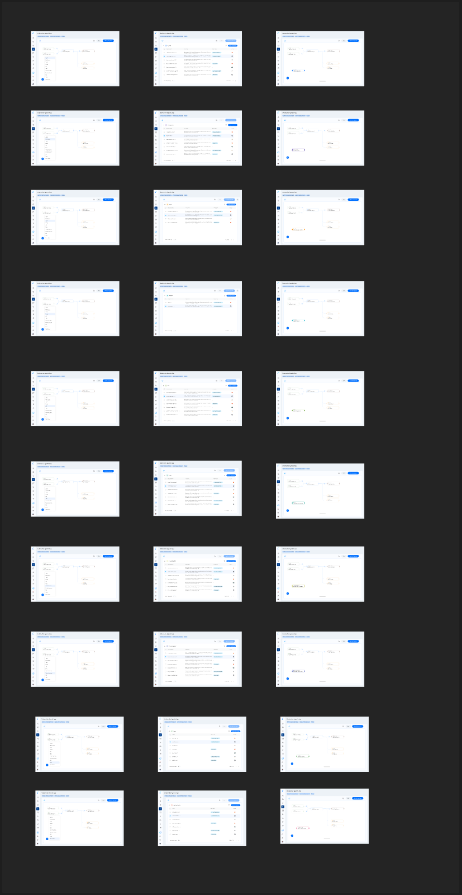

As your agentic system grows, you can add new entities right from the topology view and connect them visually — no template re-upload required.

<Frame caption="Adding an entity from the topology view (from the product design).">
  
</Frame>

## Steps

1. Open the **topology** view for your AI workload.
2. Choose **Add entity** (the **+** control).
3. Select the **entity type** — `Agent`, `Tool`, `MCPServer`, `Model`, or `API`.
4. Fill in the entity's details (id, name, and key attributes). For full attribute editing, see [Entity Detail](/ai-workload-entity-detail).
5. Draw the **connections** — wire the new entity to the agents, tools, or models it interacts with. Only valid edges are allowed (for example, only an `Agent` can invoke a `Model`).
6. **Save**. The new entity and its edges appear in the topology and become available for [policy design](/ai-workload-policy-design).

<Note>
  Reva validates connections against the agentic model — see the legal source → target edges in [Context Modeling](/ai-workload-context-modeling#entity-relationships--topology).
</Note>

## Related

<CardGroup cols={2}>
  <Card title="Edit Entity Details" icon="pen-to-square" href="/ai-workload-entity-detail">
    Refine attributes and relationships after adding.
  </Card>
  <Card title="Upload from Template" icon="file-arrow-up" href="/ai-workload-schema-upload-template">
    Bootstrap many entities at once instead.
  </Card>
</CardGroup>
