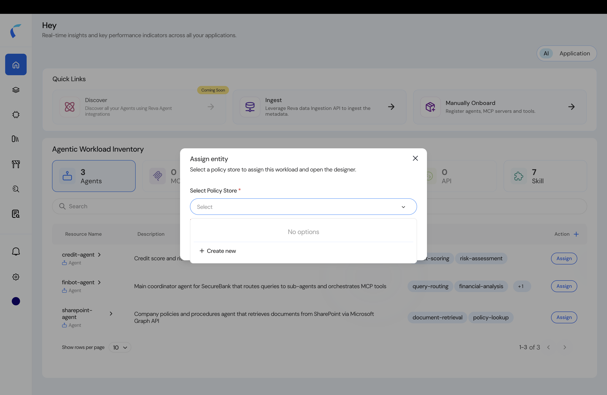

An **agentic policy store** is the container for one agentic workload — its agents and entities, schema, policies, and decision logs.

## Two Ways to Create a Store

<Steps>
  <Step title="Assign an entity from the inventory">
    In the **Agentic Workload Inventory**, click **Assign** on an entity, then **Select Policy Store → + Create new**. The new store opens with that entity already assigned.

    <Frame caption="Assign an entity, then create a new policy store.">
      
    </Frame>
  </Step>
  <Step title="Or start from Manually Onboard">
    From the AI home, use the **Manually Onboard** quick link to register agents, MCP servers, and tools into a brand-new store from scratch.
  </Step>
</Steps>

## Fill the Workload Details

<Steps>
  <Step title="Open the onboarding form">
    Either entry opens **Onboard Your Agentic Workloads**.

    <Frame caption="The Onboard Your Agentic Workloads form.">
      
    </Frame>
  </Step>
  <Step title="Enter the basic information">
    Provide the **Name** and **Application owner(s)** (required), and optionally a **Portfolio**, **Application Tags**, and a **Description**. Click **Next**.
  </Step>
  <Step title="Land on the topology designer">
    Reva creates the store and opens the **topology designer** with your assigned entity on the canvas — ready for you to add the rest and connect them.

    <Frame caption="The new store's topology designer, with the assigned agent.">
      
    </Frame>
  </Step>
</Steps>

<Info>
  **Ownership.** A newly ingested entity is *unclaimed* — no store owns it, and its metadata can't be edited. The **first** policy store you assign it to **claims ownership**: from then on, that store's members can edit the entity's metadata. Other stores can still add the entity and write policies against it, but can't change its metadata.
</Info>

## Add the Rest of Your Agents

With the store created, bring in the other entities and wire the topology:

<CardGroup cols={2}>
  <Card title="Add from Repository" icon="code-branch" href="/ai-workload-schema-add-from-repository">
    Pick entities already in your inventory and add them to this store's topology.
  </Card>
  <Card title="Build & publish the topology" icon="diagram-project" href="/ai-workload-topology-overview">
    Connect your entities, review the auto-applied guardrails, and publish.
  </Card>
</CardGroup>

<Note>
  **Guardrails are auto-applied** to every new agentic policy store. Review and manage them in the [Guardrails](/guardrails/overview) section.
</Note>
