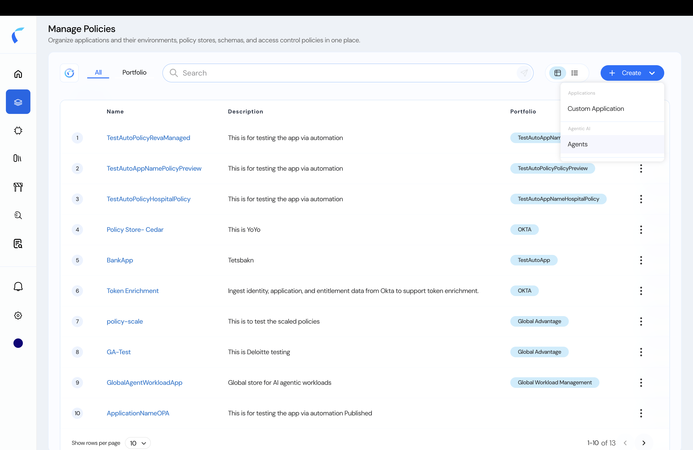
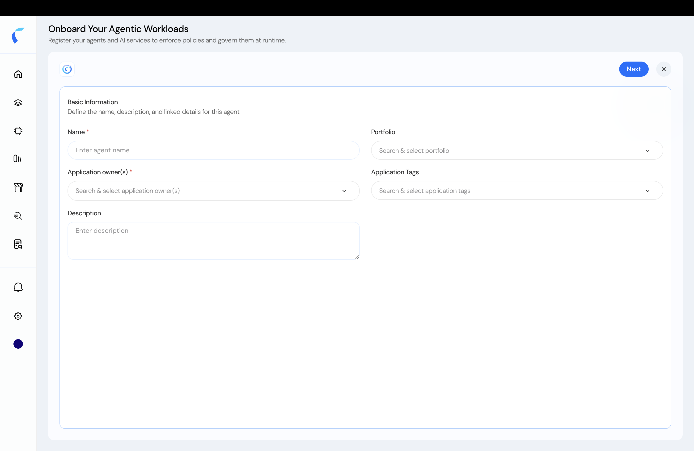
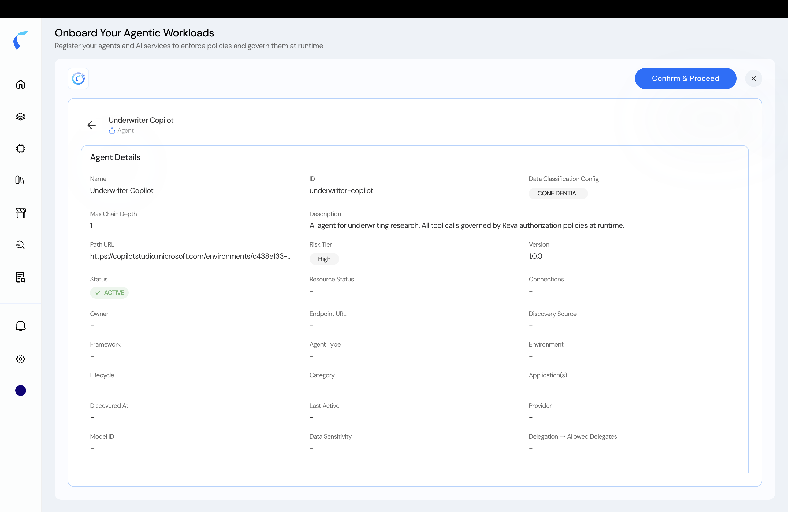
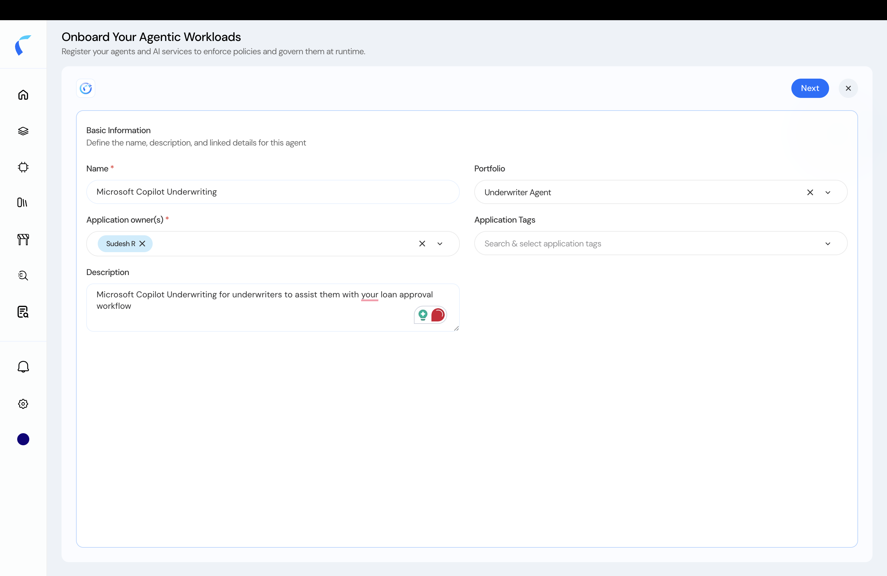

An **agentic policy store** is the container for one agentic workload — its agents and entities, schema, policies, and decision logs. Create one before you onboard agents.

## Two Ways In

<Steps>
  <Step title="From the Home page (first time)">
    In the **AI** view, the empty **Agentic Workload** panel shows an **Add Agentic Workloads** button. Click it.

    <Frame caption="Add Agentic Workloads from the empty AI Insights home.">
      
    </Frame>
  </Step>
  <Step title="From Manage Policies">
    Open **Manage Policies**, click **+**, and choose **Agent**.

    <Frame caption="Create an agentic policy store from Manage Policies → + → Agent.">
      
    </Frame>
  </Step>
</Steps>

## Fill the Workload Details

<Steps>
  <Step title="Open the onboarding form">
    Both entry points open **Onboard Your Agentic Workloads**.

    <Frame caption="The Onboard Your Agentic Workloads form.">
      
    </Frame>
  </Step>
  <Step title="Enter the basic information">
    Provide the **Name** and **Application owner(s)** (required), and optionally a **Portfolio**, **Application Tags**, and a **Description**.

    <Frame caption="Basic information for the agentic workload.">
      
    </Frame>
  </Step>
  <Step title="Continue">
    Click **Next**. Reva creates the store and asks how you want to add agents.

    <Frame caption="The completed workload details.">
      
    </Frame>
  </Step>
</Steps>

## Choose How to Add Agents

After the store is created, pick how to bring agents in:

<CardGroup cols={2}>
  <Card title="Upload from Template" icon="file-arrow-up" href="/ai-workload-schema-upload-template">
    Manually register agents from the metadata CSV template.
  </Card>
  <Card title="Add from Repository" icon="code-branch" href="/ai-workload-schema-add-from-repository">
    Select agents already discovered in a connected repository.
  </Card>
</CardGroup>

You can also [ingest entities programmatically via the API](/ai-workload-developer-settings).

<Note>
  **Guardrails are auto-applied** to every new agentic policy store. Review and manage them in the [Guardrails](/guardrails/overview) section.
</Note>
