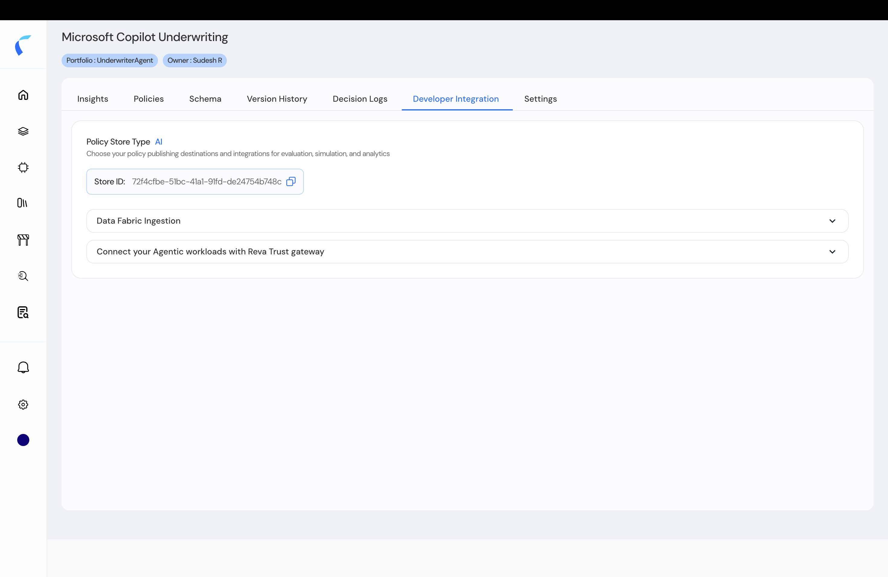
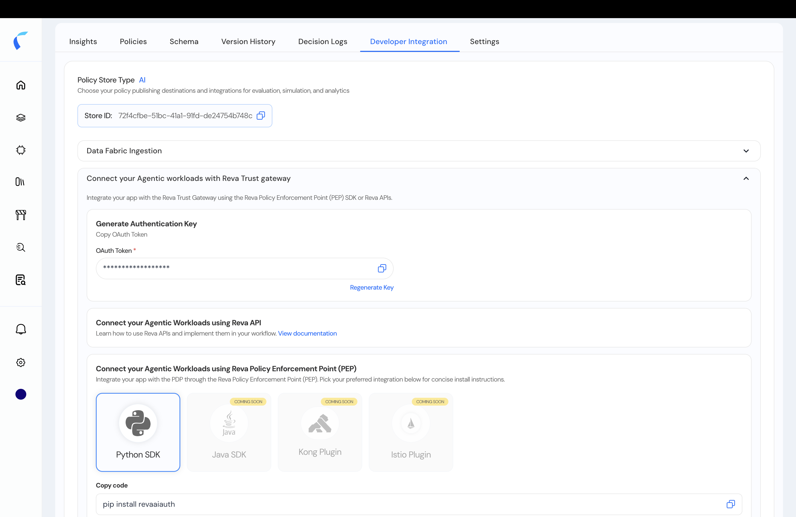
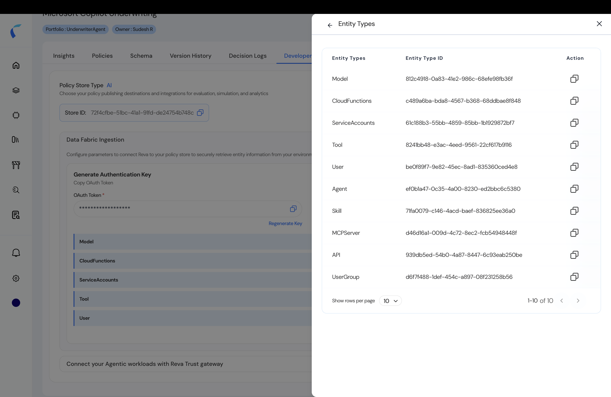

Every agentic policy store has a **Developer Integration** tab that gives you the credentials and ingestion surface your code needs — the **Store ID**, the **PDP Auth Token**, and **Data Fabric Ingestion**. These credentials drive the [Python SDK](/ai-workload-developer-sdk), the [Evaluation API](/ai-workload-developer-evaluation-api), and direct entity ingestion.

<Info>
  **Which store's credentials?** For **runtime authorization** (SDK / Evaluation API), use the credentials of the store whose policies you're evaluating. For **entity ingestion**, use the **`GlobalAgentWorkloadApp`** store's credentials — every ingested entity lands in that tenant-wide [inventory](/ai-workload-getting-started#the-inventory-and-your-policy-stores).
</Info>

## Get Your Credentials

<Steps>
  <Step title="Open Developer Integration">
    In your agentic policy store, open the **Developer Integration** tab. The **Store ID** is shown at the top.

    <Frame caption="The Developer Integration tab with the Store ID.">
      
    </Frame>
  </Step>
  <Step title="Copy the Store ID">
    The **Store ID** identifies this policy store. Use it as `POLICYSTORE_ID` in the SDK, as the `policyStoreId` header for the [Evaluation API](/ai-workload-developer-evaluation-api), and as the target for Data Fabric ingestion.
  </Step>
  <Step title="Copy the PDP Auth Token">
    In the **Connect your Agentic workloads** section, copy the **PDP Auth Token** — the long-lived platform credential sent as the API bearer (and as the SDK's `RTG_AUTH_TOKEN`).

    <Frame caption="The PDP Auth Token.">
      
    </Frame>

    <Warning>
      The PDP Auth Token is a secret. Never commit or log it; rotate it if exposed.
    </Warning>
  </Step>
</Steps>

## Ingest Entities via the API

Open the **`GlobalAgentWorkloadApp`** store's **Developer Integration** tab — ingested entities land in your tenant-wide inventory, so ingestion uses **its** **Store ID** and **PDP Auth Token**. The **Data Fabric Ingestion** section lists the entity data types you can push directly. This is the programmatic alternative to the [CSV upload](/ai-workload-schema-upload-template) — create your agents, tools, models, and relationships with the Data Fabric entity API.

<Frame caption="Data Fabric Ingestion — entity data types you can push via the API.">
  
</Frame>

<CardGroup cols={2}>
  <Card title="Create Entities API" icon="database" href="/api-reference/entity-ingestion/create-entities">
    Push entities in bulk (`POST /ingestion/v1/entity/bulk`), or [one at a time](/api-reference/entity-ingestion/create-entity).
  </Card>
  <Card title="Connect Your Agents" icon="plug" href="/ai-workload-integration-options">
    Use these credentials to integrate runtime authorization — SDK, Evaluation API, or plugin.
  </Card>
</CardGroup>
