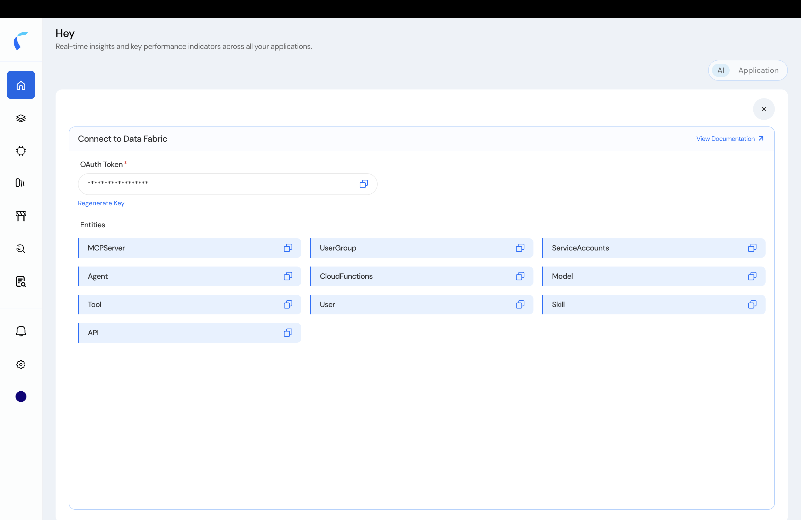
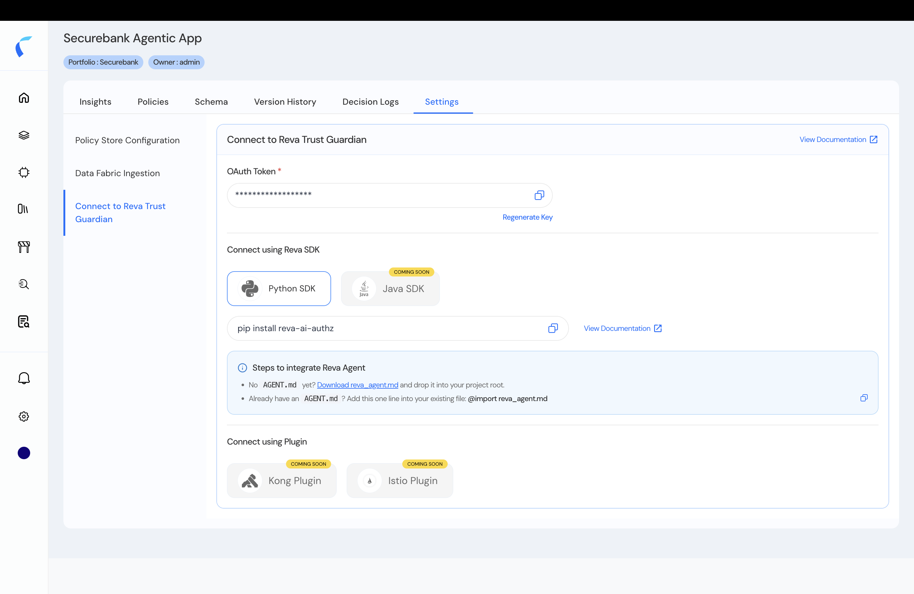

Reva gives you credentials in two places, for two jobs: **ingesting entities** into your inventory, and **connecting your agents** to the Reva Trust Guardian at runtime.

## Ingest Entities via the API

To push agents, tools, models, and relationships into your **inventory** programmatically, open the **Ingest** quick link on the AI home — the **Connect to Data Fabric** panel. Copy the **OAuth Token** and the **entity type IDs** you need, then call the Data Ingestion API.

<Frame caption="Connect to Data Fabric — the OAuth token and the entity type IDs to ingest against.">
  
</Frame>

<Warning>
  The OAuth Token is a secret. Never commit or log it; use **Regenerate Key** to rotate it if exposed.
</Warning>

<Card title="Data Ingestion API" icon="database" href="/api-reference/introduction#data-fabric-apis">
  Create entities (`POST /ingestion/v1/entity`) or in bulk (`/ingestion/v1/entity/bulk`) — see the **API Documentation** tab.
</Card>

## Connect Your Agents at Runtime

Each policy store has a **Settings** tab with everything your running code needs.

<Steps>
  <Step title="Get the Policy Store ID">
    In the store's **Settings → Policy Store Configuration**, copy the **Policy Store ID**. Use it as `POLICYSTORE_ID` in the SDK and as the `policyStoreId` header for the [Evaluation API](/ai-workload-developer-evaluation-api).
  </Step>
  <Step title="Get the Trust Guardian OAuth Token">
    In **Settings → Connect to Reva Trust Guardian**, copy the **OAuth Token** — the long-lived platform credential sent as the API bearer (and as the SDK's `RTG_AUTH_TOKEN`).

    <Frame caption="Settings → Connect to Reva Trust Guardian: OAuth token and SDK connect options.">
      
    </Frame>

    <Warning>
      The OAuth Token is a secret. Never commit or log it; rotate it with **Regenerate Key** if exposed.
    </Warning>
  </Step>
  <Step title="Choose how to connect">
    - **Python SDK** — `pip install reva-ai-authz`, then drop in the [`reva_agent.md`](/ai-workload-developer-sdk) guide.
    - **Evaluation API** — call the Trust Guardian directly. See the [Evaluation API](/ai-workload-developer-evaluation-api).
    - **Java SDK, Kong plugin, Istio plugin** — *coming soon.* See [Native Plugins](/ai-workload-native-plugins).
  </Step>
</Steps>

<CardGroup cols={2}>
  <Card title="Connect Your Agents" icon="plug" href="/ai-workload-integration-options">
    Choose the SDK, Evaluation API, or a plugin for your stack.
  </Card>
  <Card title="Python SDK" icon="code" href="/ai-workload-developer-sdk">
    Install `reva-ai-authz` and protect inbound and outbound calls.
  </Card>
</CardGroup>
