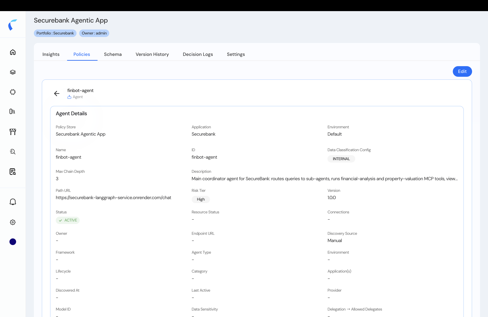
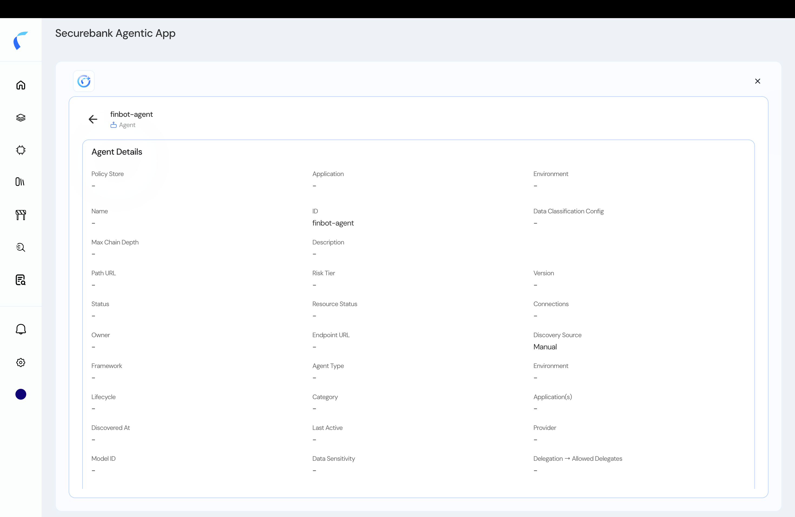

Every entity has a detail view — its **Agent Details** (or tool / model / MCP details) — where you review its metadata and skills. Accurate metadata makes your policies precise: many conditions test values like `riskTier`, `dataClassification`, or an agent's skills.

## Review an Entity

<Steps>
  <Step title="Open an entity">
    In the topology, or from the store's **Policies** tab, select an entity. **Agent Details** leads with the **Policy Store**, **Application**, and **Environment** the entity belongs to, followed by **Name**, **ID**, **Owner**, **Discovery Source**, risk tier, data classification, max chain depth, path URL, and more.

    <Frame caption="Agent Details — policy store, application, environment, owner, and the full metadata.">
      
    </Frame>
  </Step>
  <Step title="Before assignment, the store fields are empty">
    A freshly ingested entity has no policy store, application, or environment — those fill in once you **assign** it to a store and publish.

    <Frame caption="An unassigned entity's store fields are blank until it's assigned.">
      
    </Frame>
  </Step>
</Steps>

## Editing Is Owner-Only

<Info>
  You can **edit an entity's metadata only in the policy store that owns it** — the first store it was assigned to. The **Edit** button acts on the owning store's copy; in any other store the details are read-only, though you can still add the entity and write policies against it.
</Info>

To edit: open the entity in the **owning** store, click **Edit**, change the fields, and **Save**. Updated attributes are immediately available to policies that reference them.

## Manage Skills

An agent's **skills** describe what it can do — and you can write [intent/skill-based policies](/ai-workload-policy-design) against them. In the owning store, you can **add, edit, or delete** an agent's skills.

<Steps>
  <Step title="Open the agent's Skills">
    In the agent's detail view, find the **Skills** section.
  </Step>
  <Step title="Add or edit a skill">
    Click **Add Skill** (or edit an existing one) and set its **Name**, **ID**, **Description**, **Source**, and **Risk Tier**.

    <Frame caption="Add a skill to an agent.">
      
    </Frame>
  </Step>
  <Step title="Save">
    Save. The skill is now available for intent/skill-based policies.
  </Step>
</Steps>

## Manage Across Stores

If an entity belongs to several policy stores, click **Manage** on it in the inventory — Reva shows a **dropdown of its policy stores** so you can pick which store's policies to work on.

<Tip>
  Set `riskTier` and `dataClassification` thoughtfully — they're commonly used in on-behalf-of and context-based policy conditions.
</Tip>
