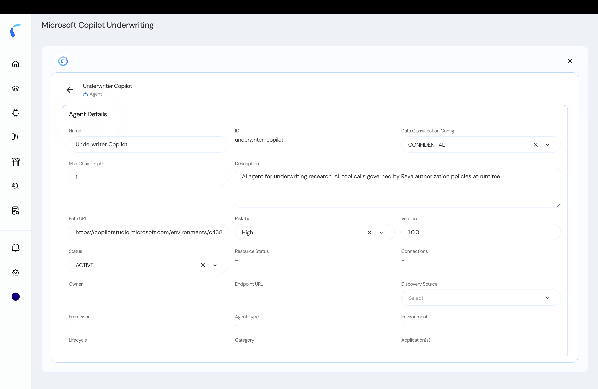

Each entity in your topology has a detail view where you review and edit its attributes, relationships, and metadata. Accurate attributes make your policies precise — many policies test values like `riskTier` or a custom field.

<Steps>
  <Step title="Select an entity">
    In the topology (or the agent inventory), select an entity to open its detail panel.
  </Step>
  <Step title="Review and edit">
    Review the entity's **attributes**, **relationships** (what it invokes and is invoked by), and **metadata**. Click **Edit** to change any field.

    <Frame caption="Edit an entity's metadata and attributes.">
      
    </Frame>
  </Step>
  <Step title="Save">
    **Save** your changes. Updated attributes are immediately available to policies that reference them.
  </Step>
</Steps>

<Tip>
  Set `riskTier` and `dataClassification` thoughtfully — these attributes are commonly used in on-behalf-of and context-based policy conditions.
</Tip>
