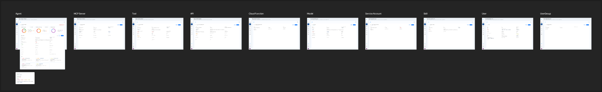

Each entity in your topology — an agent, tool, model, MCP server, or API — has a detail view where you can review and edit its attributes, relationships, and metadata. Keeping these accurate is what makes your policies precise.

<Frame caption="Entity detail view and edit (from the product design).">
  
</Frame>

## Steps

1. Open the **topology** view (or the agent inventory) and select an entity.
2. Review the entity's detail panel:
   - **Attributes** — e.g., `riskTier`, `dataClassification`, `connectionType`, and any custom attributes.
   - **Relationships** — what this entity can invoke, and what can invoke it.
   - **Metadata** — name, description, version, status.
3. Choose **Edit** to update any field.
4. Adjust attributes or relationships as needed.
5. **Save** your changes. Updated attributes are immediately available to policies that reference them.

<Tip>
  Set `riskTier` and `dataClassification` thoughtfully — these attributes are commonly used in conditions, so accurate values make your context-based and OBO policies more effective.
</Tip>

## Related

<CardGroup cols={2}>
  <Card title="Context Modeling" icon="diagram-project" href="/ai-workload-context-modeling">
    The entity and attribute model behind these details.
  </Card>
  <Card title="Add from Topology View" icon="circle-plus" href="/ai-workload-add-entity-from-topology">
    Create a new entity directly on the graph.
  </Card>
</CardGroup>
