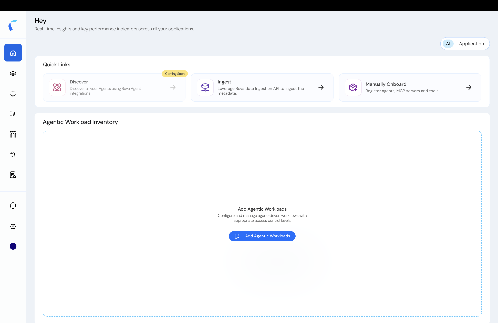
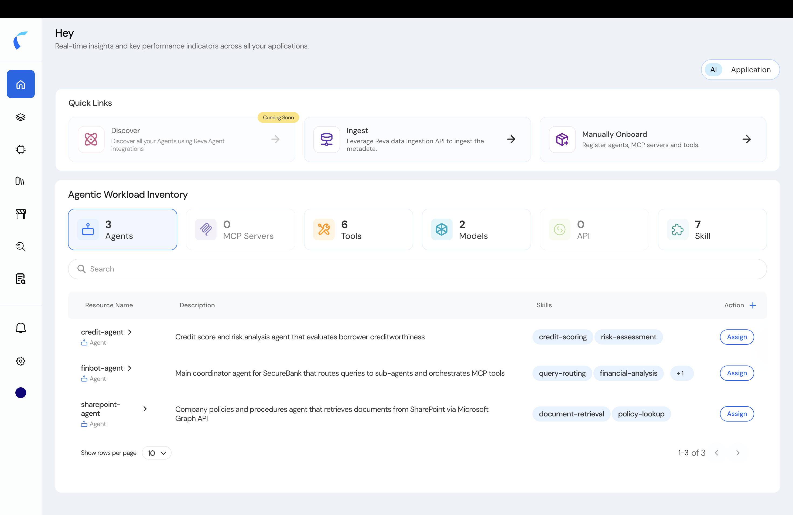
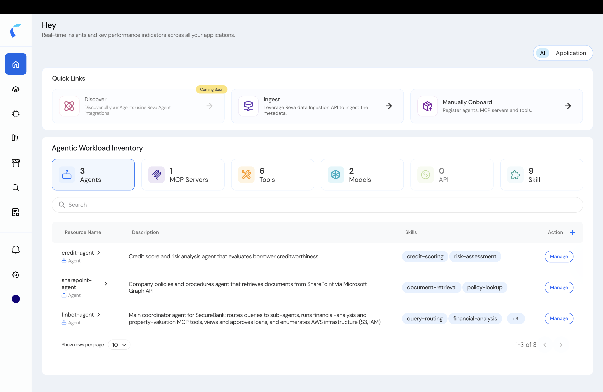

This guide takes you from the empty day-one screen to published, least-privilege policies for an agentic AI workload.

## The AI Home

Switch the home page to the **AI** view. You get two things: **Quick Links** to bring workloads in, and the **Agentic Workload Inventory** — your tenant-wide list of agents, MCP servers, tools, models, APIs, and skills.

<Frame caption="The AI home — Quick Links plus an empty Agentic Workload Inventory on day one.">
  
</Frame>

Once agents are in, the inventory fills with counts and a searchable table. Each entity carries an **Assign** action — its way into a policy store.

<Frame caption="A populated inventory. Each entity has an Assign action.">
  
</Frame>

## Three Ways to Get Agents In

The three **Quick Links** are your three ways to populate the inventory:

| Quick Link | What it does | Where |
|:-----------|:-------------|:------|
| **Discover** | Auto-discover agents, tools, models, and skills from your Microsoft Entra and Azure tenant. | [Microsoft Agentic AI Workloads](/azure-agent-integration) |
| **Ingest** | Push agents, tools, models, and relationships programmatically with the **Data Ingestion API**, using an OAuth token and the entity type IDs. | [Developer Settings](/ai-workload-developer-settings#ingest-entities-via-the-api) |
| **Manually Onboard** | Register agents, MCP servers, and tools by creating a policy store and building its topology. | [Create an Agentic Policy Store](/ai-workload-create-policy-store) |

<Note>
  New to the entity model? See [AI Workload Context Modeling](/ai-workload-context-modeling) for the agents, tools, models, and topology rules your policies reference.
</Note>

## From Inventory to Governed: Assign, Own, Manage

Once an entity is in your inventory, a single lifecycle takes it to enforcement:

<Steps>
  <Step title="Assign the entity to a policy store">
    In the inventory, click **Assign** on an entity. Reva asks you to **Select Policy Store** — pick an existing one, or **+ Create new** to start a fresh store with this entity assigned.

    <Frame caption="Assign an entity: select a policy store, or create a new one.">
      
    </Frame>
  </Step>
  <Step title="The first store claims ownership">
    The **first** policy store an entity is assigned to becomes its **owner**. Only the owner can edit the entity's metadata; other stores can add it and write policies, but not change its metadata. See [Create an Agentic Policy Store](/ai-workload-create-policy-store).
  </Step>
  <Step title="Build the topology and publish">
    In the store's designer, **Add from Repository** to pull in the rest of your entities, connect them, and **Publish**. See [The Agentic Topology](/ai-workload-topology-overview).
  </Step>
  <Step title="Manage going forward">
    After publishing, the entity's inventory action changes from **Assign** to **Manage**. If an entity belongs to several stores, **Manage** lets you pick which store's policies to work on.

    <Frame caption="After assignment, the inventory action becomes Manage.">
      
    </Frame>
  </Step>
</Steps>
