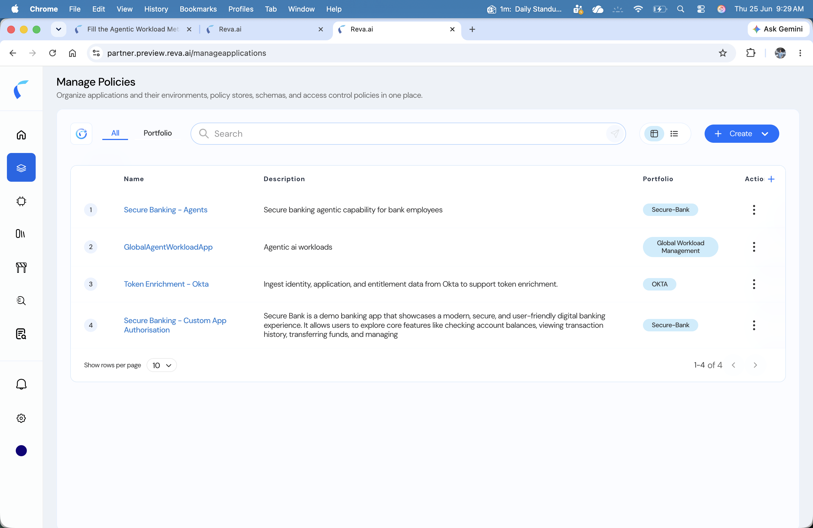
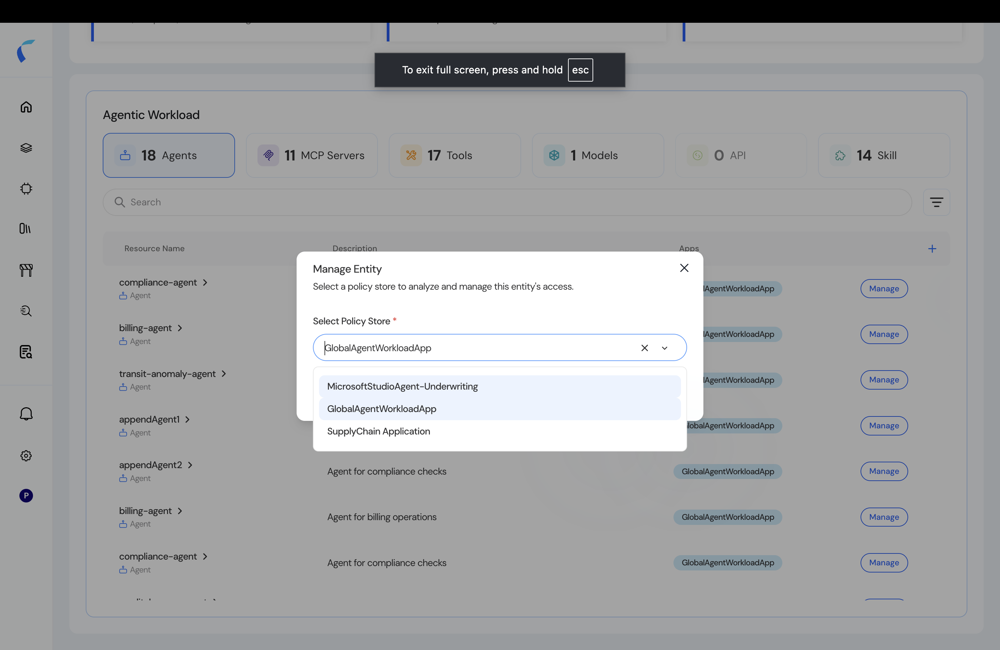
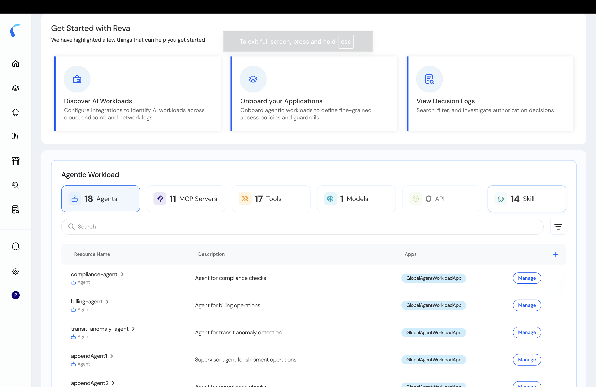
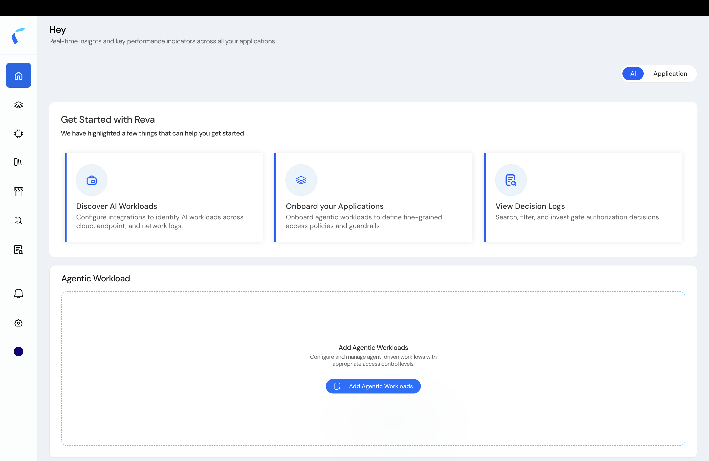

This guide takes you from the empty day-one screen to published, least-privilege policies for an agentic AI workload.

## The Journey

The path from zero to governed agents — read on for the details of each stage:

1. **Onboard your agents** — pre-populate your inventory, then create a policy store and add agents to it.
2. **Work in the topology** — the hub where you assign policies.
3. **Design policies** — start from permit-all, then forbid to scope.
4. **Integrate** — connect your agents via the SDK, Evaluation API, or a native plugin.
5. **Operate** — audit every decision in the logs.

## The Inventory and Your Policy Stores

Every Reva tenant is bootstrapped with a global agentic policy store called **`GlobalAgentWorkloadApp`**. Every entity you ingest — agents, MCP servers, tools, models, and skills — lands here and populates your tenant-wide **inventory** (the **Agentic Workload** panel on the AI home).

<Frame caption="GlobalAgentWorkloadApp — the global agentic store every tenant starts with — listed alongside your own policy stores.">
  
</Frame>

You generally **don't author policies directly in `GlobalAgentWorkloadApp`** — it's the shared landing zone for everything you ingest. (You *can*, but it isn't the intended workflow.) Instead, create one or more **purpose-specific policy stores** — for example *Secure Banking – Agents* or *SupplyChain Application* — and add the relevant entities from your inventory into each. Every store keeps its own schema, policies, and decision logs.

From the inventory, click **Manage** on any entity to work on its access. Because an entity can belong to several stores, Reva asks **which policy store** you want to open, then takes you to that store's topology.

<Frame caption="Manage an entity: pick which policy store to open.">
  
</Frame>

## How Agents Get Into Reva

Getting agents into a governed policy store happens in two stages.

**Stage 1 — Pre-populate your inventory** *(optional, ahead of time).* These land entities directly in `GlobalAgentWorkloadApp`, with no policy store required yet:

| Method | What it is | Where |
|:-------|:-----------|:------|
| **Ingestion API** | Push agents, tools, models, and relationships programmatically with the Data Fabric entity API, using the **`GlobalAgentWorkloadApp`** **Store ID** + **PDP Auth Token**. | [Developer Settings](/ai-workload-developer-settings) → [Create Entities API](/api-reference/entity-ingestion/create-entities) |
| **Discovery integrations** *(Roadmap)* | Azure and other discovery sources auto-add agents to your inventory. | [Azure Agent Integration](/azure-agent-integration) |

**Stage 2 — Onboard agents into a policy store** *(when you create one).* Choose one:

| Method | What it is | Where |
|:-------|:-----------|:------|
| **Add from Repository** | Pull agents that are already in your inventory into the new store. Best after Stage 1. | [Add from the Inventory](/ai-workload-schema-add-from-repository) |
| **Upload a CSV template** | Download the metadata template, fill it, upload, and review. The way in when your inventory is empty. | [Upload from Template](/ai-workload-schema-upload-template) |

<Note>
  **Upload** and **Add from Repository** appear only *inside* the store-creation flow (after **Add Agentic Workloads** or **Manage Policies → + → Agent**). Ingestion and discovery populate the inventory independently, before any store exists.
</Note>

## Your First Run

How you start depends on whether your inventory already has agents.

### If your inventory is already populated

You've run the **ingestion API** or a **discovery integration**, so your agents are already sitting in `GlobalAgentWorkloadApp`. Bring them into a purpose-specific store straight from the inventory:

<Steps>
  <Step title="Open the inventory">
    On the Home page, switch to the **AI** view. The **Agentic Workload** panel lists your ingested agents, tools, models, and MCP servers.

    <Frame caption="A populated agentic workload inventory.">
      
    </Frame>
  </Step>
  <Step title="Manage an entity, pick or create a store">
    Click **Manage** on an agent, then use the **Select Policy Store** dropdown (shown above) to choose an existing store — or **+ Create new policy store** to start a fresh one with this entity pre-selected. See [Create an Agentic Policy Store](/ai-workload-create-policy-store).
  </Step>
  <Step title="Add the rest from the inventory">
    In the store, use **Add from Repository** to pull in the other agents you need, then proceed to the topology. See [Add from the Inventory](/ai-workload-schema-add-from-repository).
  </Step>
</Steps>

### If you're starting fresh

Nothing is ingested yet, so you create a store and upload your agents:

<Steps>
  <Step title="Open AI Insights">
    On the Home page, switch to the **AI** view. On day one, the **Agentic Workload** panel is empty.

    <Frame caption="The empty Agentic Workload panel on the AI Insights home.">
      
    </Frame>
  </Step>
  <Step title="Create an agentic policy store">
    Click **Add Agentic Workloads** (or **Manage Policies → + → Agent**) and fill the onboarding form. See [Create an Agentic Policy Store](/ai-workload-create-policy-store).
  </Step>
  <Step title="Upload the metadata template">
    Because your inventory is empty, **Upload CSV** is your way in: download the template, fill it, upload, and **review** the parsed entities before proceeding. See [Onboard by Uploading the Template](/ai-workload-schema-upload-template).
  </Step>
  <Step title="Land on the topology">
    Reva renders your agentic **topology** — the hub where you assign policies. Guardrails are auto-applied to the new store.
  </Step>
</Steps>
