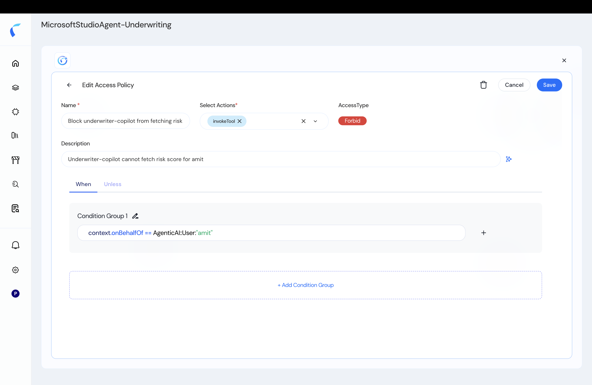
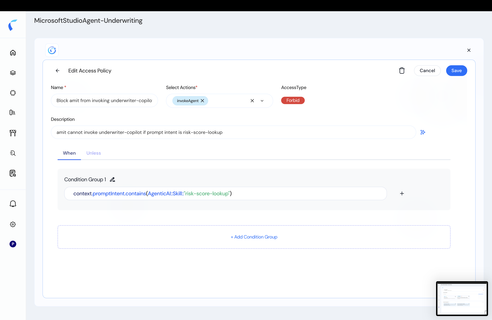
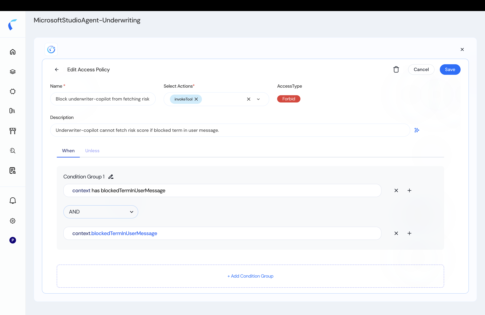

Once your agents are in the [topology](/ai-workload-topology-overview), you write policies that decide which interactions are allowed. Reva's Policy Designer gives you a visual builder and a Cedar editor, backed by versioned policy stores.

## Start from Permit-All, Then Forbid

When a policy store is created, **every connected entity already has a full-access permit (allow-all) policy.** You tighten access by adding **forbid** policies that *reduce* scope — because in Cedar, an explicit `forbid` always overrides a `permit`.

Every policy answers four questions, plus runtime context:

| Component | In an agent chain | Example |
|:----------|:------------------|:--------|
| **Principal** | Who is making the call | an `Agent` or `User` |
| **Action** | What kind of call | `invokeAgent`, `invokeTool`, `invokeModel` |
| **Resource** | What is being called | an `Agent`, `Tool`, `MCPServer`, or `Model` |
| **Context** | Runtime facts to test | `onBehalfOf`, `promptIntent`, and runtime attributes |

## Two Ways to Author

1. **Visual mode** — the **Edit Access Policy** form: set a **Name**, **Select Actions**, an **Access Type** (Permit or Forbid), and build conditions in the **When / Unless** condition groups — no code required.
2. **Developer mode** — write Cedar directly.

<Info>
  **Schema first.** A condition can only reference attributes that exist in the schema. To test a runtime value (like an MCP tool payload field), add it first — see [Schema & Runtime Attributes](/ai-workload-schema-runtime-attributes).
</Info>

## Policy Styles

Agentic forbid policies commonly use three styles. The examples below are the real conditions from the Policy Designer (note the `AgenticAI::` namespace).

### On-Behalf-Of (OBO) Policies

Decide using the delegating user carried in `context.onBehalfOf`. Here, the underwriter copilot **cannot** fetch the risk score when acting on behalf of `amit`:

<Frame caption="An on-behalf-of forbid policy in the Policy Designer.">
  
</Frame>

<CodeGroup>
```cedar On-behalf-of
forbid (
    principal,
    action   == AgenticAI::Action::"invokeTool",
    resource
)
when { context.onBehalfOf == AgenticAI::User::"amit" };
```
</CodeGroup>

### Intent / Skill-Based Policies

Decide using the purpose of the request via `context.promptIntent`. Here, `amit` **cannot** invoke the underwriter copilot when the prompt intent is the `risk-score-lookup` skill:

<Frame caption="An intent/skill-based forbid policy.">
  
</Frame>

<CodeGroup>
```cedar Intent / skill
forbid (
    principal,
    action   == AgenticAI::Action::"invokeAgent",
    resource
)
when { context.promptIntent.contains(AgenticAI::Skill::"risk-score-lookup") };
```
</CodeGroup>

### Context-Based Policies

Decide using runtime values — including guardrail signals — passed in `context`. Here, the tool call is **forbidden** when a blocked term is detected in the user's message:

<Frame caption="A context-based forbid policy using a guardrail signal.">
  
</Frame>

<CodeGroup>
```cedar Context-based
forbid (
    principal,
    action   == AgenticAI::Action::"invokeTool",
    resource
)
when { context has blockedTermInUserMessage && context.blockedTermInUserMessage };
```
</CodeGroup>

## Generate Policies with Reva AI

You don't have to start from scratch — describe the access you want and let Reva AI draft (or edit) the policy.

<Card title="Generate & Edit Policies with Reva AI" icon="wand-magic-sparkles" href="/ai-workload-policy-generated">
  Author and refine agentic policies in plain English.
</Card>

## Publish

Review your draft policies, then **Publish** to activate. If approval is required (for non-owner contributors), the draft moves to Pending Actions for review.

<Frame caption="Publishing the policy store.">
  
</Frame>

## Sample Policies

<a href="/reva-agentic-sample-policies.cedar" className="text-blue-600 font-semibold underline" download>Download sample agentic Cedar policies (.cedar)</a>
