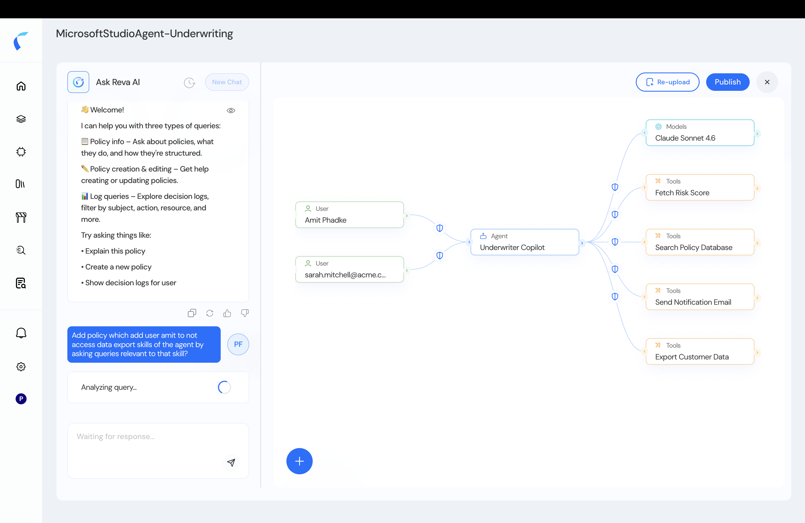
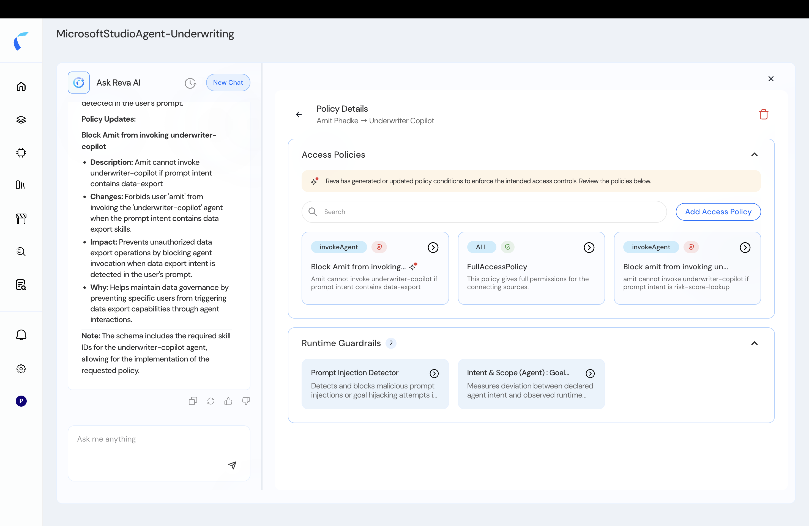
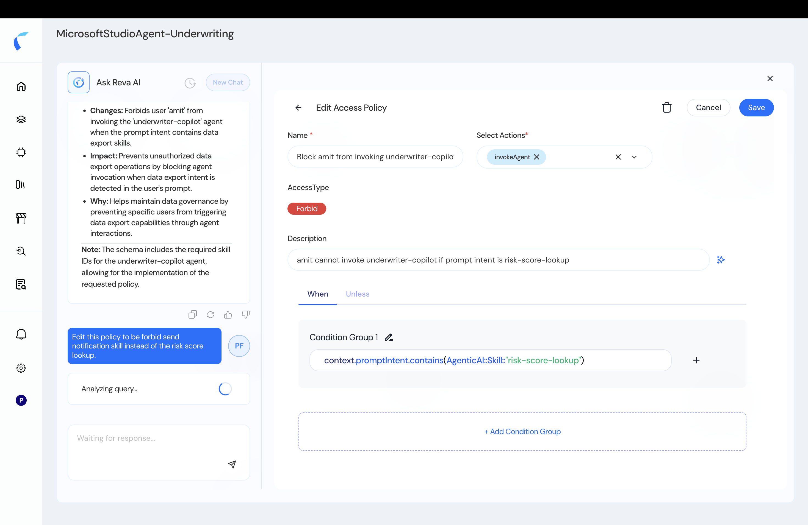
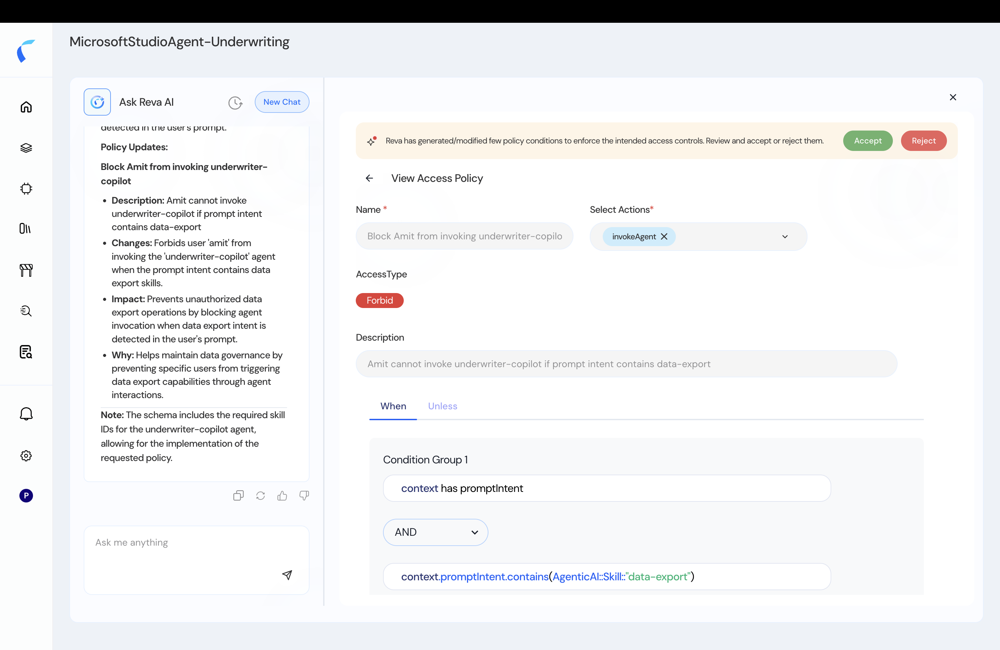
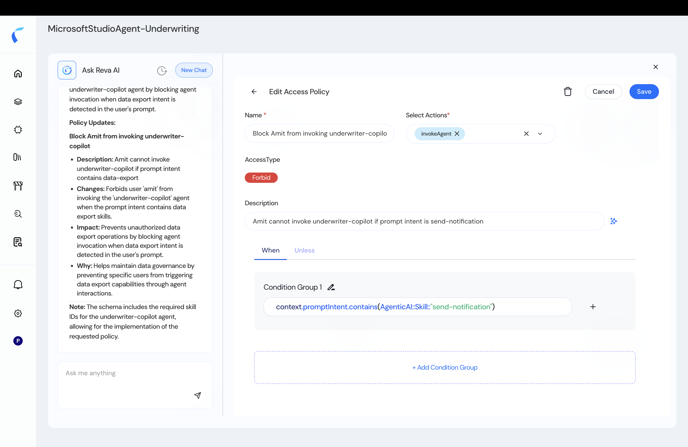

Reva AI can draft **and** edit agentic policies from a plain-English description — you describe the access you want, review what Reva proposes, and publish.

## Create a Policy with AI

<Steps>
  <Step title="Open the Policy Designer and choose Create with AI">
    In your policy store, open the **Policies** tab → **Policy Designer**, then choose **Create with AI**.

    <Frame caption="Create a policy with Reva AI.">
      
    </Frame>
  </Step>
  <Step title="Describe the access in plain English">
    For example: *"Forbid the underwriter copilot from invoking the risk-lookup tool when acting on behalf of amit."*
  </Step>
  <Step title="Review the drafted policy">
    Reva drafts the principal, action, resource, and conditions. Refine it in Visual or Cedar mode.

    <Frame caption="The AI-drafted policy in the panel.">
      
    </Frame>
  </Step>
  <Step title="Publish">
    Once it's right, **Publish** to activate.
  </Step>
</Steps>

## Edit a Policy with AI

<Warning>
  Edit-with-AI acts on the policy you have **open**. Select and open the specific policy first — you can't edit from a blank state.
</Warning>

<Steps>
  <Step title="Open the policy you want to change">
    Select the policy in the list so it's open in the editor.
  </Step>
  <Step title="Ask Reva AI for the change">
    Describe the edit — for example, *"Edit this policy to forbid the send-notification skill instead of risk-score-lookup."* Reva AI returns the **Changes**, **Impact**, and **Why**.

    <Frame caption="Ask Reva AI — Changes, Impact, and Why.">
      
    </Frame>
  </Step>
  <Step title="Review and accept">
    Review the proposed change and **Accept** it.

    <Frame caption="Accept the AI's changes.">
      
    </Frame>
  </Step>
  <Step title="Confirm the update">
    The policy is updated and ready to publish.

    <Frame caption="The edited policy.">
      
    </Frame>
  </Step>
</Steps>

<Note>
  Always review AI-generated and AI-edited policies before publishing. Reva AI explains its Changes / Impact / Why, but you own the final policy.
</Note>
