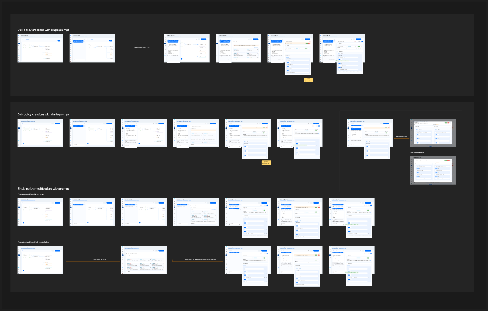

Reva AI can draft agentic access policies from a plain-English description. You describe the access you want, review the generated policy, refine it, and publish — a fast way to start without writing Cedar by hand.

<Frame caption="AI-generated access policy flow — describe, generate, review, and refine (from the product design).">
  
</Frame>

## Steps

1. Open your AI workload policy store and go to the **Policies** tab, then open the **Policy Designer**.
2. Choose **Create with Reva AI**.
3. Describe the access in plain English — for example:
   > Allow the billing agent to invoke the rate MCP tool only when acting on behalf of a low-risk user.
4. Reva AI drafts a policy with the **principal**, **action**, **resource**, and **conditions** it inferred.
5. Review and refine the draft in Visual or Developer mode — confirm the entities and conditions match your intent.
6. [Test the policy](/ai-workload-policy-testing) against your topology, then **Publish**.

<Note>
  Always review AI-generated policies before publishing. Treat the draft as a starting point and validate it the same way you would a hand-written policy.
</Note>

## Related

<Card title="Policy Design" icon="shield-halved" href="/ai-workload-policy-design">
  The full guide to agentic policy styles — context-based, on-behalf-of, and intent-based.
</Card>
