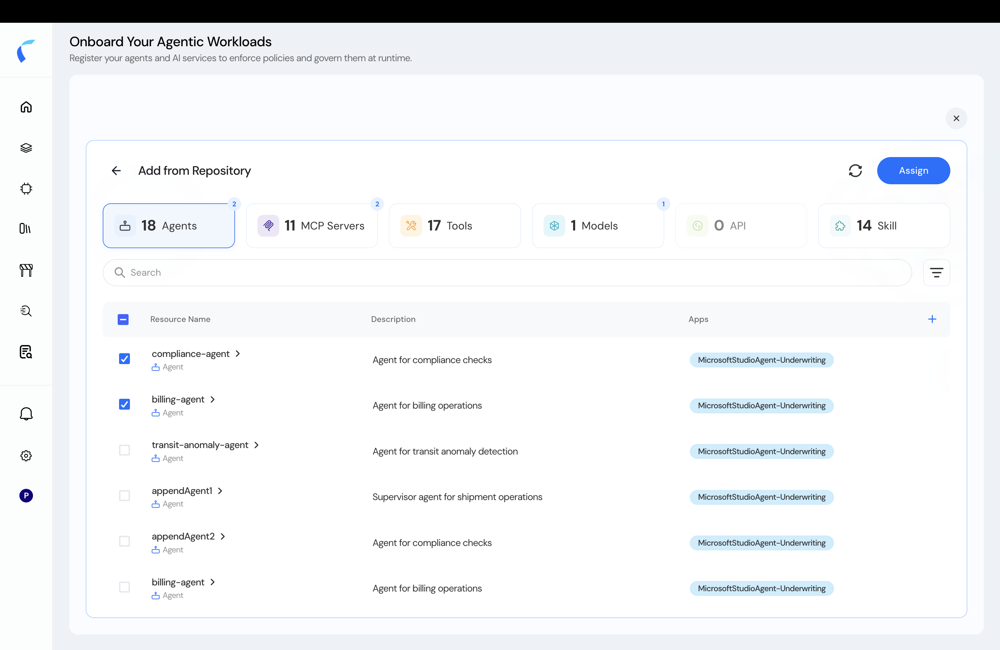

When you create an agentic policy store, **Add from Repository** lets you pull in agents that are already in your **Reva inventory** — no template upload needed for this store.

Your inventory is populated by any of these:

- **Entity ingestion API** — push agents, tools, models, and relationships programmatically. See [Developer Settings](/ai-workload-developer-settings) and [Create Entities](/api-reference/entity-ingestion/create-entities).
- **Discovery sources** *(roadmap)* — Azure and other sources auto-add agents to your inventory. See [Azure Agent Integration](/azure-agent-integration).
- **CSV upload** — register agents from the [metadata template](/ai-workload-schema-upload-template).

## Add from the Inventory

<Steps>
  <Step title="Choose Add from Repository">
    When creating the agentic policy store, select **Add from Repository**. Reva lists the agents already in your inventory.

    <Frame caption="Agents available from your inventory.">
      
    </Frame>
  </Step>
  <Step title="Select the agents to add">
    Choose the agents, tools, MCP servers, and models to bring into this policy store.
  </Step>
  <Step title="Proceed to the topology">
    Confirm. The selected entities import into your **topology**, ready for [policy design](/ai-workload-topology-overview).
  </Step>
</Steps>

<Tip>
  After adding, refine each entity's attributes and skills — see [View & Edit Entity Details](/ai-workload-entity-detail).
</Tip>
