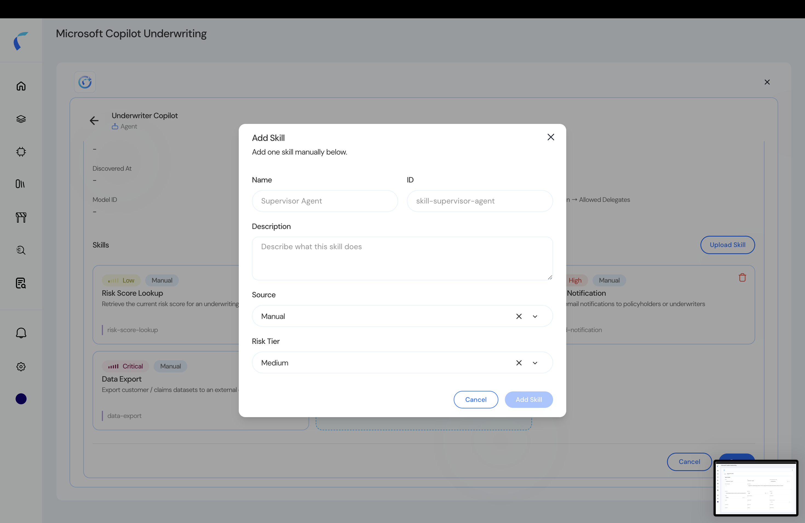

If your agents are already present in a connected source-control repository, you can add them directly when creating the policy store — no template needed.

## Prerequisites

Connect the repository first:

<CardGroup cols={2}>
  <Card title="GitHub Integration" icon="github" href="/github-integration">
    Connect a GitHub repository to Reva.
  </Card>
  <Card title="GitLab Integration" icon="gitlab" href="/gitlab-integration">
    Connect a GitLab repository to Reva.
  </Card>
</CardGroup>

## Steps

<Steps>
  <Step title="Choose Add from Repository">
    When creating the agentic policy store, select **Add from Repository**. Reva lists the agents and skills already discovered in the connected repo.

    <Frame caption="Agents available from the repository.">
      
    </Frame>
  </Step>
  <Step title="Select the agents and skills">
    Choose the agents, tools, MCP servers, and skills to bring in.

    <Frame caption="Select agents and their skills.">
      
    </Frame>
  </Step>
  <Step title="Proceed to the topology">
    Confirm. The selected entities import into your **topology**, ready for [policy design](/ai-workload-topology-overview).
  </Step>
</Steps>

<Tip>
  After importing, open individual entities to fill in attributes the scan couldn't infer — risk tier, data classification, and so on. See [Entity Detail](/ai-workload-entity-detail).
</Tip>
