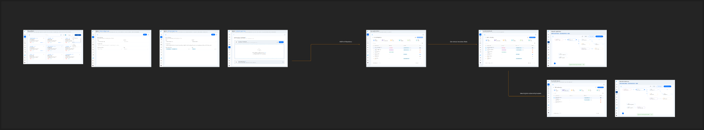

If your agents live in a codebase, Reva can scan the repository to discover agents, tools, and MCP servers and add them to your topology — no manual data entry required.

<Frame caption="Add-from-repository flow — connect a repo, scan, review, and import discovered entities (from the product design).">
  
</Frame>

## Prerequisites

Connect the source-control integration for the repository you want to scan:

<CardGroup cols={2}>
  <Card title="GitHub Integration" icon="github" href="/github-integration">
    Connect a GitHub repository to Reva.
  </Card>
  <Card title="GitLab Integration" icon="gitlab" href="/gitlab-integration">
    Connect a GitLab repository to Reva.
  </Card>
</CardGroup>

## Steps

1. In Reva, open your AI workload onboarding and choose **Add from repository**.
2. Select the connected repository (and branch, if prompted).
3. Start the scan. Reva inspects the code for agents, tools, and MCP servers.
4. Review the discovered entities and their proposed relationships.
5. Select the entities to import and confirm.
6. The imported entities appear in your topology view, ready for [policy design](/ai-workload-policy-design).

<Tip>
  After importing, open individual entities to fill in attributes the scan couldn't infer (risk tier, data classification, custom fields) — see [Entity Detail](/ai-workload-entity-detail).
</Tip>
