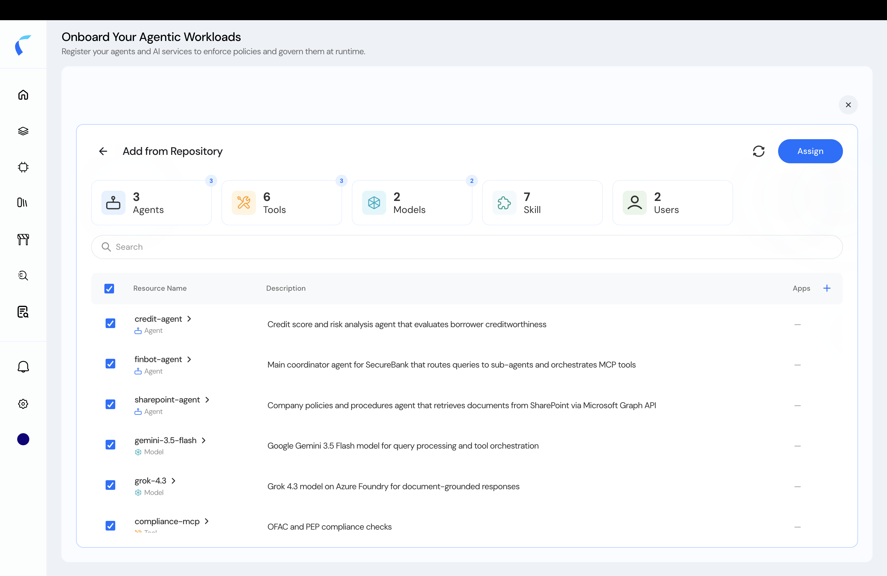

When you're building a policy store's topology, **Add from Repository** lets you pull in entities that are already in your **Reva inventory** — no re-onboarding needed. The inventory holds everything you've brought in via **Ingest**, [**Discover**](/azure-agent-integration), or a previous manual onboard.

## Add from the Inventory

<Steps>
  <Step title="Open Add from Repository">
    In the topology designer, choose **Add from Repository**. Reva lists everything in your inventory, grouped by type — **Agents, Tools, Models, Skills, Users** (and MCP servers).

    <Frame caption="Add from Repository — pick entities from your inventory.">
      
    </Frame>
  </Step>
  <Step title="Select the entities to add">
    Tick the agents, tools, MCP servers, models, and users you want in this store. Use search to narrow a large inventory.
  </Step>
  <Step title="Assign them into the store">
    Click **Assign**. The selected entities drop onto the **topology** canvas, ready for you to connect and publish.
  </Step>
</Steps>

<Info>
  **Metadata is owned by one store.** You can add any inventory entity to as many stores as you like and write policies against it — but you can only **edit its metadata** in the store that **owns** it (the first store it was assigned to). Everywhere else, the metadata is read-only.
</Info>

<Tip>
  Need entities that aren't in your inventory yet? Bring them in first via the [Data Ingestion API](/ai-workload-developer-settings#ingest-entities-via-the-api), then Add from Repository.
</Tip>
