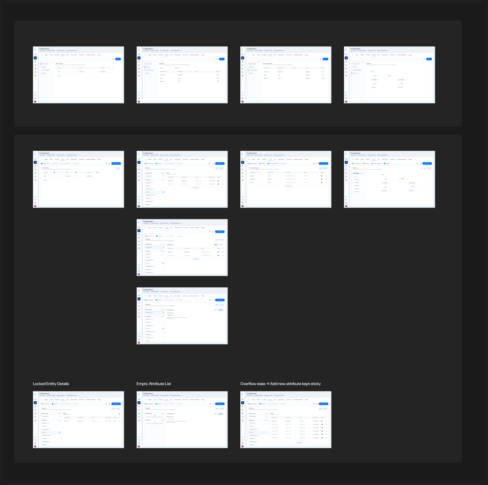

To write [context-based policies](/ai-workload-policy-design#context-based-policies), the values your agents send at runtime — an MCP tool's `container_id`, a custom risk flag, and so on — must exist in your schema as **attributes**. The Schema view lets you review your entities and add the runtime attributes you want to govern.

<Frame caption="Schema view and edit — adding runtime attributes for tool and custom fields (from the product design).">
  
</Frame>

## Steps

1. Open your AI workload policy store and go to the **Schema** tab.
2. Select the entity you want to extend — for example a `Tool`, `MCPServer`, or a custom entity type.
3. Review the entity's existing attributes in the detail view.
4. Choose **Add attribute** and define:
   - **Name** — the field your agent sends (e.g., `container_id`).
   - **Type** — string, number, boolean, set, or record.
   - **Required** — whether the attribute must be present.
5. Save the attribute, then **activate** the schema so the Policy Designer recognizes it.
6. Reference the attribute in a policy condition, e.g. `when { context.container_id == "MSCU4429881" }`.

<Tip>
  Add an attribute for every runtime value your policies test. If a policy references an attribute that isn't in the (activated) schema, it won't evaluate as you expect.
</Tip>

## Related

<CardGroup cols={2}>
  <Card title="Context Modeling" icon="diagram-project" href="/ai-workload-context-modeling">
    The full entity and attribute model for agentic workloads.
  </Card>
  <Card title="Policy Design" icon="shield-halved" href="/ai-workload-policy-design">
    Use your attributes in context-based, OBO, and intent-based policies.
  </Card>
</CardGroup>
