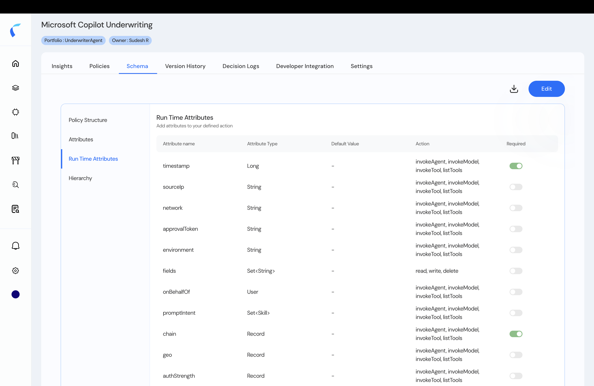
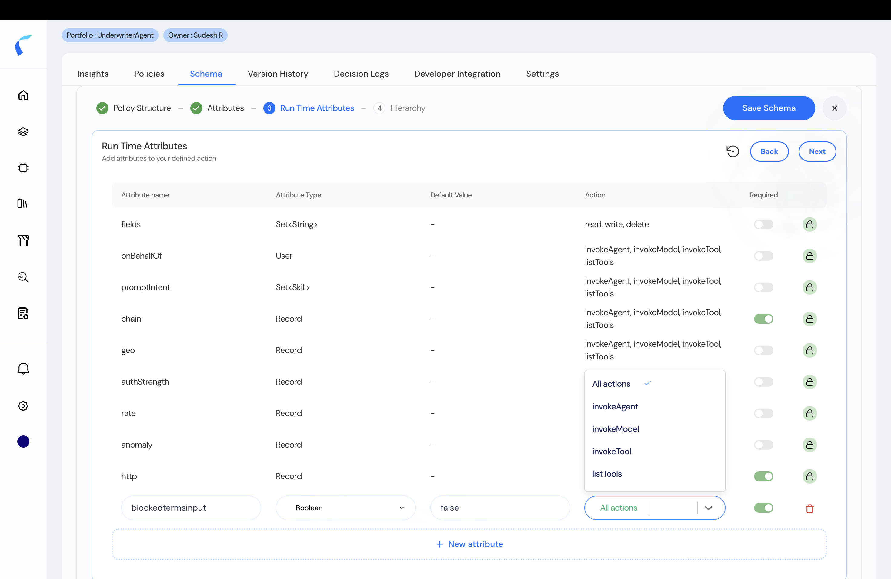

The **Schema** tab shows the agentic AI schema Reva publishes for your workload. You can't change the published structure — but you can **add Run Time Attributes**: the values your agents pass at runtime (an MCP/tool payload field, a risk flag, and so on) that you then reference in policy conditions.

<Steps>
  <Step title="Open the Schema tab">
    In your policy store, open **Schema** to view the published agentic schema.

    <Frame caption="The published agentic AI schema.">
      
    </Frame>
  </Step>
  <Step title="Go to Run Time Attributes">
    The schema is a short wizard — Policy Structure → Attributes → **Run Time Attributes** → Hierarchy. Reva's structure is read-only; you add your attributes on the **Run Time Attributes** step.
  </Step>
  <Step title="Add an attribute">
    Click **+ New attribute** and define its **Name**, **Type** (String, Boolean, Set, Record…), **Default Value**, the **Action(s)** it applies to (e.g. `invokeTool`), and whether it's **Required**.

    <Frame caption="Add a runtime attribute.">
      
    </Frame>
  </Step>
  <Step title="Save the schema">
    Click **Save Schema**. The attribute is now available in the Policy Designer.
  </Step>
  <Step title="Reference it in a policy">
    Use it in a condition — for example `when { context has blockedTermInUserMessage && context.blockedTermInUserMessage }`. See [Policy Design](/ai-workload-policy-design).
  </Step>
</Steps>

<Tip>
  A policy that references an attribute which isn't in the **saved** schema won't evaluate as you expect. Add and save the attribute first.
</Tip>
