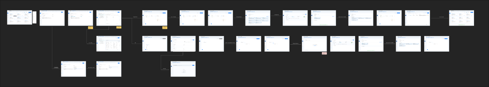

The fastest way to model an existing agentic system is to download the metadata template, fill it with your entities and their relationships, and upload it. Reva parses the files and renders your **topology view** — the graph of who can invoke whom.

<Frame caption="Upload-from-template flow — download, fill, upload, and review the parsed topology (from the product design).">
  
</Frame>

## Steps

1. Download the template and fill it following the field guide:
   <Card title="Fill the Agentic Workload Metadata Template" icon="file-lines" href="/ai-workload-metadata-template">
     Per-entity, per-attribute instructions, with the template download.
   </Card>
2. In Reva, open your AI workload onboarding and choose **Upload from template**.
3. Select your completed template (the `entities/` folders and `topology.csv`).
4. Reva validates the files and reports any errors (missing required fields, bad enums, unresolved references).
5. Review the parsed **entities** and **topology** preview.
6. Confirm to create the entities and render the topology view.

<Note>
  Re-uploading currently **replaces** the existing set rather than appending to it. Keep your filled template as the source of truth so you can re-upload a complete set when something changes.
</Note>

## Related

<CardGroup cols={2}>
  <Card title="Add from Repository" icon="code-branch" href="/ai-workload-schema-add-from-repository">
    Discover agents and tools by scanning a connected repo instead.
  </Card>
  <Card title="Add from Topology View" icon="diagram-project" href="/ai-workload-add-entity-from-topology">
    Add or wire entities directly on the graph.
  </Card>
</CardGroup>
