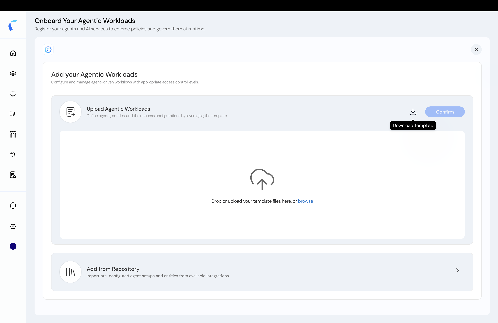
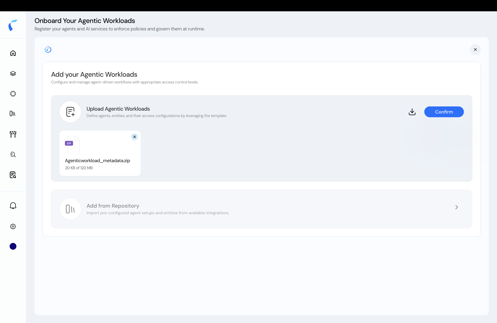
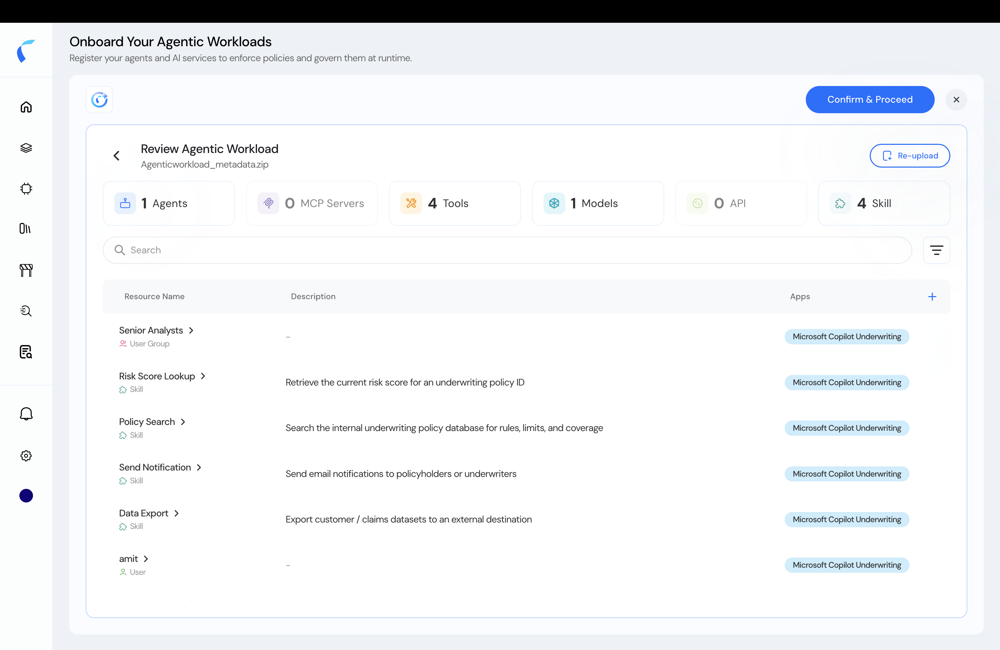
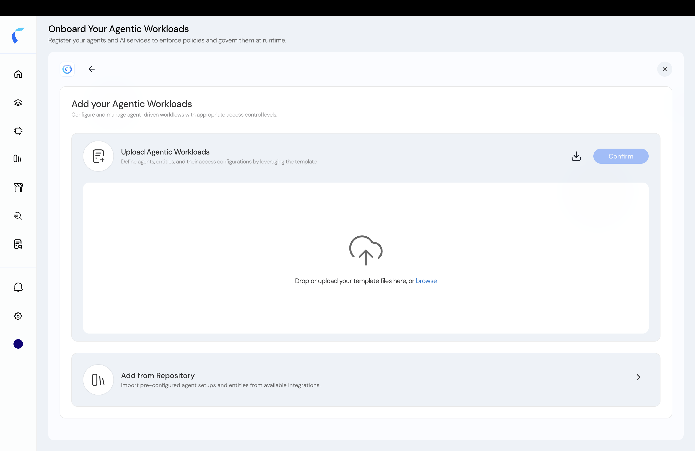

Uploading the **metadata template** is the manual way to register your agents, tools, models, and MCP servers — and the relationships between them. Reva parses the files, lets you review the result, and renders your topology.

<Steps>
  <Step title="Download the template">
    On the upload screen, download the metadata template, then fill it following the [field guide](/ai-workload-metadata-template).

    <Frame caption="Download the metadata template.">
      
    </Frame>
  </Step>
  <Step title="Upload your filled template">
    Select your completed files — the `entities/` folders and `topology.csv`.

    <Frame caption="Upload the filled template.">
      
    </Frame>
  </Step>
  <Step title="Review the parsed workload">
    Reva validates the files and shows a **Review Agentic Workload** summary — entity counts and a table of every agent, tool, model, skill, and user it found. Check it before committing.

    <Frame caption="Review the parsed entities before proceeding.">
      
    </Frame>
  </Step>
  <Step title="Confirm & proceed">
    Click **Confirm & Proceed**. Reva renders your **topology** — the hub for [assigning policies](/ai-workload-topology-overview).
  </Step>
</Steps>

<Note>
  Need to change the set? Use **Re-upload** to return to the upload screen. Re-uploading **replaces** the existing entities rather than appending — keep your filled template as the source of truth.
</Note>

<Frame caption="Re-upload returns you to the upload screen.">
  
</Frame>

## Related

<CardGroup cols={2}>
  <Card title="Fill the Metadata Template" icon="file-lines" href="/ai-workload-metadata-template">
    The per-column field guide and template download.
  </Card>
  <Card title="Add from Repository" icon="code-branch" href="/ai-workload-schema-add-from-repository">
    Onboard agents already in a connected repository instead.
  </Card>
</CardGroup>
