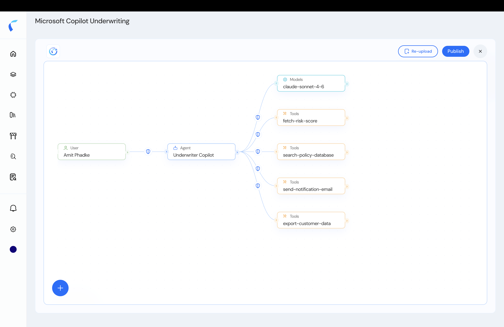
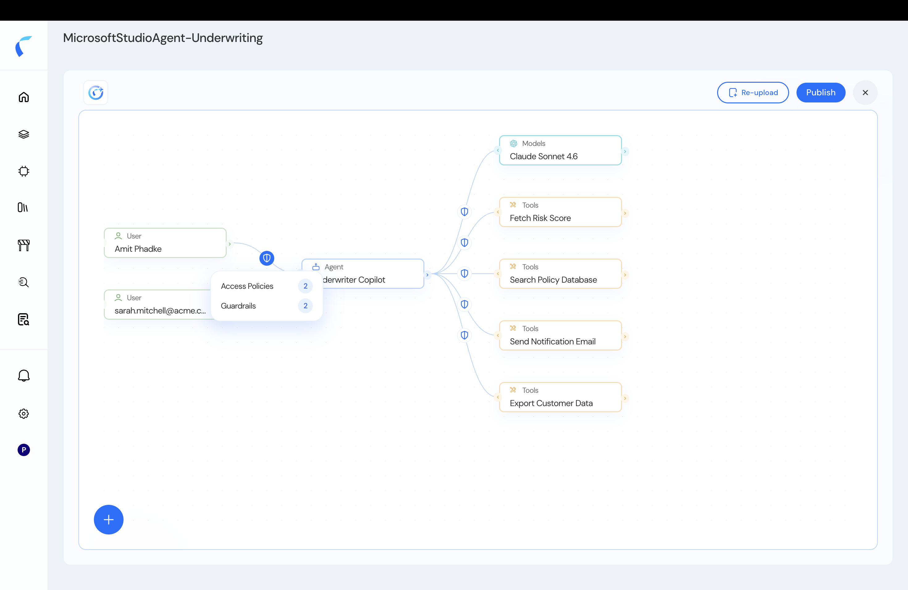
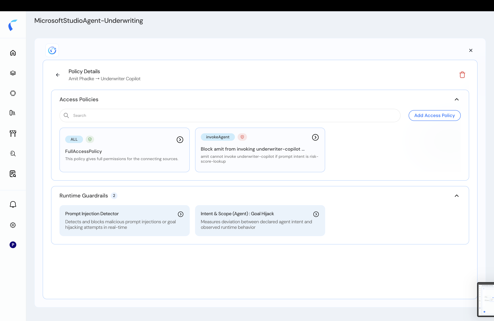
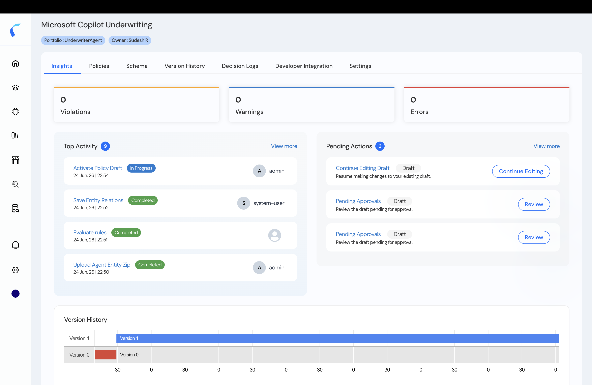

After onboarding, you land on the **topology** — a graph of your users, agents, tools, models, and MCP servers, and the connections between them. The topology is where you manage access: inspect each entity and connection, and attach policies.

<Frame caption="The agentic topology — entities and their connections.">
  
</Frame>

## The Default Posture: Permit-All, Then Forbid

When your topology is first created, **every connected entity starts with a full-access permit (allow-all) policy.** You then add **forbid** policies to *reduce* scope — blocking specific interactions, users, or intents. This permit-all → forbid model lets you start working immediately and tighten access deliberately.

Selecting an entity shows its **Access Policies** and **Guardrails** — guardrails are **auto-applied** to the store.

<Frame caption="An entity's access policies and auto-applied guardrails.">
  
</Frame>

## Govern Access

<Steps>
  <Step title="Inspect an entity or connection">
    Select a node or edge to see its current policies and guardrails.

    <Frame caption="Policy and guardrail details for a connection.">
      
    </Frame>
  </Step>
  <Step title="Add forbid policies to reduce scope">
    Write context-based, on-behalf-of, or intent/skill policies to block specific interactions. See [Policy Design](/ai-workload-policy-design).
  </Step>
  <Step title="Publish">
    Click **Publish** to activate your policies. Decisions then appear in the decision logs.

    <Frame caption="Publishing the policy store.">
      
    </Frame>
  </Step>
</Steps>

## More in the Topology

<CardGroup cols={2}>
  <Card title="Build a Topology Manually" icon="circle-plus" href="/ai-workload-add-entity-from-topology">
    Add entities and wire connections yourself.
  </Card>
  <Card title="View & Edit Entity Details" icon="pen-to-square" href="/ai-workload-entity-detail">
    Inspect and edit an entity's attributes and relationships.
  </Card>
  <Card title="Add Runtime Attributes" icon="sliders" href="/ai-workload-schema-runtime-attributes">
    Extend the schema to write richer policies.
  </Card>
  <Card title="Decision Logs" icon="list-check" href="/decision-logs">
    Audit every authorization decision.
  </Card>
</CardGroup>

<Note>
  Guardrails are auto-applied to new policy stores and managed separately — see [Guardrails](/guardrails/overview).
</Note>
