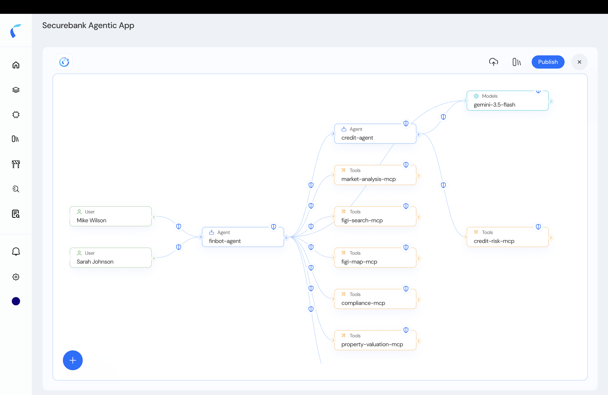
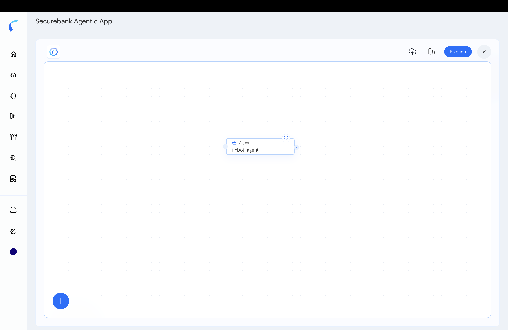
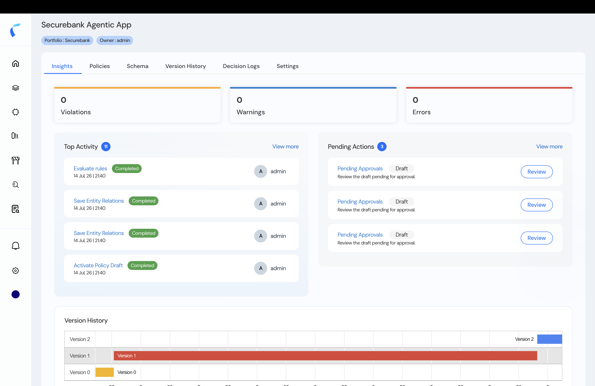

When you create a policy store, you land on the **topology designer** — the canvas for your workload's users, agents, tools, models, and MCP servers, and the connections between them. It's where you assemble the graph, attach policies, and publish.

<Frame caption="The topology designer — entities and their connections, each edge guarded.">
  
</Frame>

<Tip>
  You also reach a store's topology from the **inventory**: click **Manage** on any entity and pick the policy store you want to open.
</Tip>

## Build the Topology

<Steps>
  <Step title="Start from your assigned entity">
    A new store opens with the entity you assigned on the canvas. Add the rest with **[Add from Repository](/ai-workload-schema-add-from-repository)** (or **+** to add a single entity).

    <Frame caption="A new store opens with the assigned agent.">
      
    </Frame>
  </Step>
  <Step title="Connect the entities">
    Draw the connections that mirror how your agents actually call each other, their tools, and models. Reva **auto-applies a guardrail** to each connection — the shield on every edge.
  </Step>
  <Step title="Publish">
    Click **Publish** to activate the store. Reva runs its checks and records the version; decisions then flow to the [decision logs](/decision-logs).

    <Frame caption="Publishing lands you on the store's Insights dashboard.">
      
    </Frame>
  </Step>
</Steps>

## The Default Posture: Permit-All, Then Forbid

When your topology is first created, **every connected entity starts with a full-access permit (allow-all) policy.** You then add **forbid** policies to *reduce* scope — blocking specific interactions, users, or intents. This permit-all → forbid model lets you start working immediately and tighten access deliberately. Selecting an entity or connection shows its **Access Policies** and auto-applied **Guardrails**.

<Steps>
  <Step title="Inspect an entity or connection">
    Select a node or edge to see its current policies and guardrails.
  </Step>
  <Step title="Add forbid policies to reduce scope">
    Write context-based, on-behalf-of, or intent/skill policies to block specific interactions. See [Policy Design](/ai-workload-policy-design).
  </Step>
  <Step title="Re-publish">
    Publish again to activate the tightened policies.
  </Step>
</Steps>

## More in the Topology

<CardGroup cols={2}>
  <Card title="Add from Repository" icon="code-branch" href="/ai-workload-schema-add-from-repository">
    Pull entities from your inventory onto the canvas.
  </Card>
  <Card title="Build a Topology Manually" icon="circle-plus" href="/ai-workload-add-entity-from-topology">
    Add a single entity and wire connections yourself.
  </Card>
  <Card title="View & Edit Entity Details" icon="pen-to-square" href="/ai-workload-entity-detail">
    Inspect an entity's metadata (and edit it if you own it).
  </Card>
  <Card title="Decision Logs" icon="list-check" href="/decision-logs">
    Audit every authorization decision.
  </Card>
</CardGroup>

<Note>
  Guardrails are auto-applied to new policy stores and managed separately — see [Guardrails](/guardrails/overview).
</Note>
