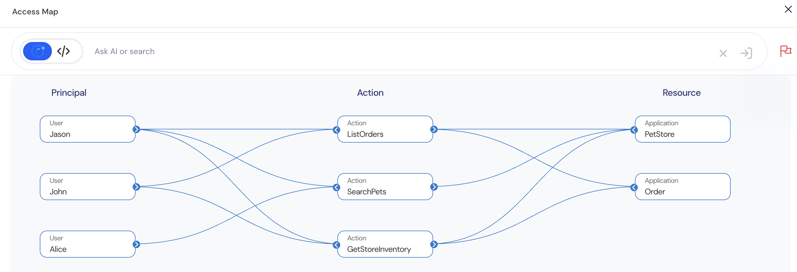

Impact Analysis helps administrators evaluate how policies behave under real-world scenarios using simulated test data. It ensures confidence that the policy logic will enforce access decisions as intended when deployed to production.

## Reviewing Simulation Results using Access Map Visualization
Reva automatically generates a Visual Access Map that provides a graphical representation of access relationships:  

The Access Map simplifies analysis of:
1. Who has access to which resources. 
-  Quickly visualize which users (Principals) are permitted access to specific resources.   
2. Which actions are permitted for each user.
-  Understand which operations (Actions) users can perform on each resource.  
3. Cross-role access intersections. 
-  Identify overlapping or conflicting access granted across multiple roles or assignments.  

### How to Access the Access Map
 
1. Navigate to Policy Store
2. Go to Policies tab
3. Click on Test to initiate simulation
4. Once the test completes, the Access Map is generated based on the simulation results.

### Natural Language Access Search
Reva supports interactive querying of the Access Map using simple natural language queries:
*Example Queries:*  
- *What access does John have?*   
- *Who can list orders?*  
- *What actions are allowed on PetStore?*  

The system parses queries and filters the Access Map to display matching access paths, accelerating audits, troubleshooting, and access reviews.

## Impact Analysis Workflow

| Step              | Activity                                                        |
|:----------------- |:--------------------------------------------------------------- |
| Prepare Schema    | Upload schema defining entities                                 |
| Upload Test Data  | Upload data via Onboarding or Policy Store                      |
| Run Simulation    | Execute policy evaluations                                      |
| Review Access Map | Visualize results and relationships                             |
| Perform Search    | Use natural language search to drill into specific access paths |
| Adjust Policies   | Update policies based on findings                               |
| Promote Policies  | Confidently deploy to production                                |

