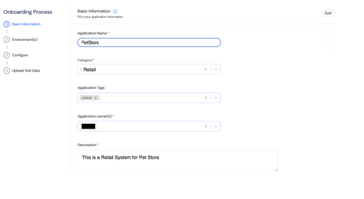

Provide essential information to begin the registration process for an application, including its name, category, and description. Assign owners and tags to ensure proper management, organization, and governance across all stages.

### Basic Application Information

1. **Enter the Application Name**  
   Enter the Application Name (e.g., "PetStore"). This is the name used to register for the application.  
2. **Choose the Category of the Application**  
   Choose the Category of the application (e.g., "Retail", "Health"). This helps groups report applications based on their domain.  
3. **Add Application Tags**  
   Add Application Tags for better organization (e.g., "critical", "external"). Tags assist with quick filtering and identification.  
4. **Assign Application Owner(s)**  
   Assign Application Owner(s) responsible for managing the application. Owners are accountable for its operations and governance.  
5. **Write a Description**  
   Write a Description summarizing the application's purpose. This provides a quick overview of its functionality.
