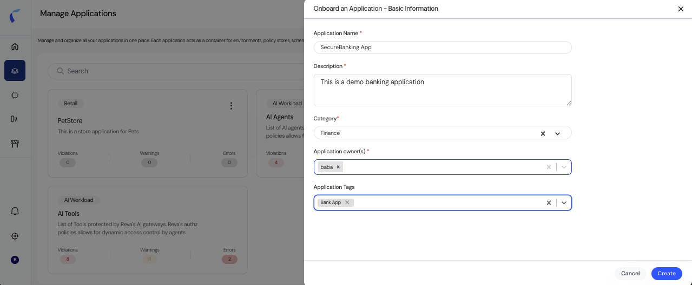
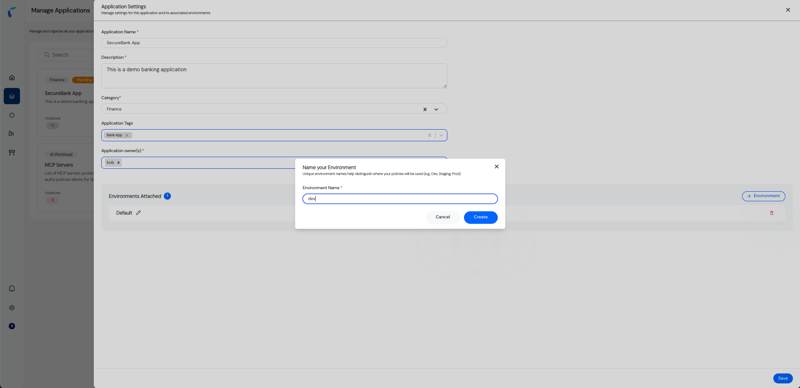
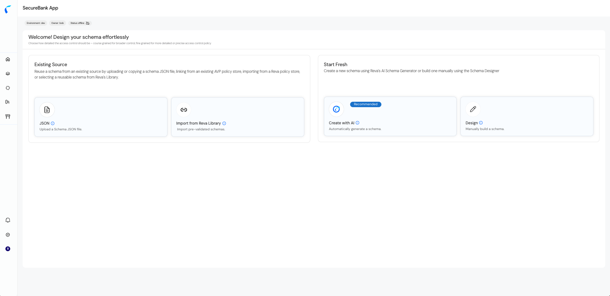

You can update application details or manage environments anytime from Manage Policies.  

<Info> Click the three vertical dots (⋮) next to the application and select Settings. </Info>  

## Update Application Details  
You can also edit:  
1. **Application Name** (e.g., SecureBank App)  
2. **Description** (e.g., Banking application for QA testing)  
3. **Category** (e.g., Finance, Retail)  
4. **Tags** (e.g., critical, external)  
5. **Owners** (e.g., bob, alice)  

## Manage Environments
1. **Rename the Default Environment**  
   - Example: Change **Default** to **Dev**.
   - This helps separate development from other environments.
   
2. **Create a New Environment**   
   - Example: Add a new environment called **Prod**.
   - Once created, you are directed to the **Schema Onboarding** page to begin defining schemas.   
   