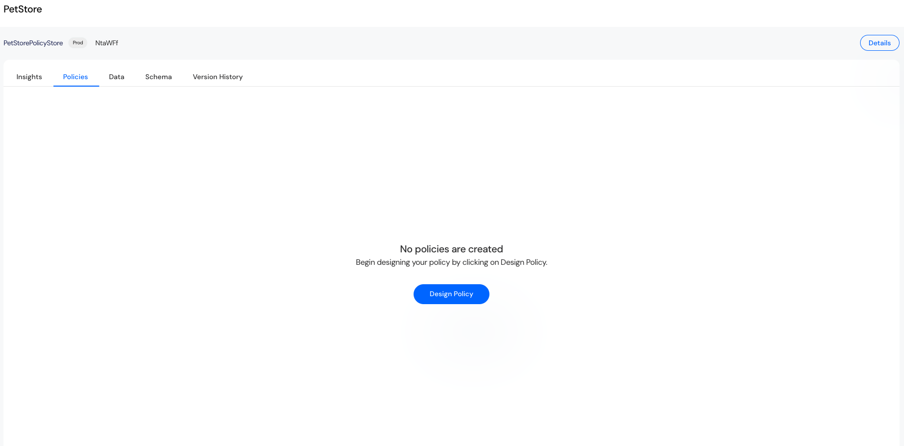
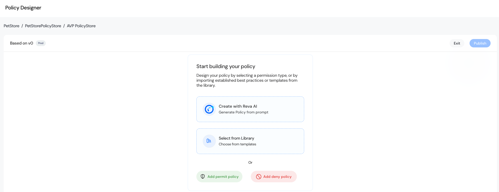
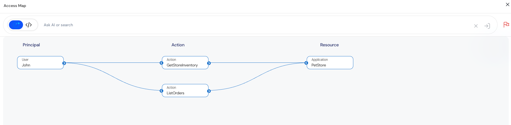
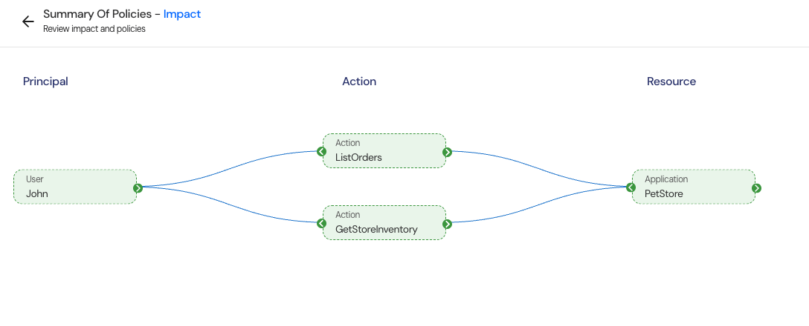

Reva’s Policy Designer provides a structured, guided interface for authoring, modifying, and validating authorization policies. Both business users and developers can collaboratively create fine-grained access control models using a combination of visual builders, conditional logic, and direct policy coding — all governed by versioned policy stores with built-in approval workflows.  

## Authorization Policy Model Overview  
Every Reva authorization policy answers four fundamental questions:  

| Component                | Description                        | Example                                                 |
|:------------------------ |:---------------------------------- |:------------------------------------------------------- |
| **Principal**            | Who is requesting access?          | `User`, `Role`, `Group` (e.g., `Nurse`, `Admin`)        |
| **Action**               | What operation is being performed? | `view`, `edit`, `delete`                                |
| **Resource**             | What object is being accessed?     | `PatientRecord`, `Invoice`                              |
| **Condition (Optional)** | What constraints apply?            | Time-based, department-based, sensitivity-based filters |  

Policies enforce an Effect (Allow/Deny) and can include optional metadata such as descriptions and audit information.  

## Policy Designer Interface
1. **Visual Mode** (Business User Friendly)  
   - Interactive UI for defining principals, actions, resources, and conditions.  
   - The Condition Builder allows complex logic construction using attribute selectors and operators — all without writing code.  
2. **Developer Mode** (Cedar Code Support)  
   - Advanced users can author policies directly using Cedar language for maximum control.  
   - The editor offers full syntax support and flexibility to define sophisticated authorization logic.  

## Key Requirement: Schema First Approach  

Before authoring any policies, the Authorization Schema must be defined and activated. The schema provides the foundational structure by defining the entities, attributes, and relationships your policies will reference.  

1. Schema Components   

| Schema Element  | Description                      | Examples                                      |
|:--------------- |:-------------------------------- |:--------------------------------------------- |
| **Principals**  | Who requests access?             | `User`, `Role`, `Doctor`, `BillingService`    |
| **Actions**     | What actions are allowed?        | `ViewRecords`, `ApprovePayments`              |
| **Resources**   | What data or system is accessed? | `PatientFile`, `Invoice`                      |
| **Attributes**  | Fine-grained qualifiers          | `security_level: high`, `department: finance` |
| **Hierarchies** | Entity relationships             | `Hospital → Ward → PatientBed`                |

<Info>Important: Activate the schema before proceeding with policy creation to ensure policy designer recognizes available entities.</Info>  
2. Test Data Preparation  
After schema activation, users can generate a Data Template from the console to populate test datasets that will be used for validating policies.
   - The template includes pre-defined folder structures and CSV files for each entity type.  
   - Populate test data for Principals, Resources, and Attributes.  
   - This data drives simulations and Access Map visualizations during policy testing.  

## How to Access PetStore Policy Store
1. Navigate to Policy Store (e.g., PetStore).
2. Click on the Policies tab.

## Step-by-Step Flow: Policy Store Owner Create, Modify or Delete Policies  
1. **Open Policy Designer**  

      

2. **Create New Policy**  

      

   You have three ways to begin:  
     - Create with Reva AI — Use AI to generate policies from natural language prompts.  
     - Select from Library — Import pre-built templates from the Library.  
     - Manual Creation — Start with Permit Policy or Deny Policy.  
   Click on Add permit policy or Add deny policy to start manual creation.  
3. **Define Policy Rules**  
   The Policy Designer uses a graph-based canvas to visually define:  

   | Component     | Description                        | Example                           |
   |:------------- |:---------------------------------- |:--------------------------------- |
   | **Principal** | Select users, roles, or groups     | User `John`                       |
   | **Action**    | Define permitted actions           | `ListOrders`, `GetStoreInventory` |
   | **Resource**  | Define target application/resource | `PetStore`                        |
   | **Condition** | Optional logic expressions         | `when {true}`                     |  
   - Use "+" connectors to add components.  
   - Multiple policies can be created in one canvas.  

<Info>Example: Allow user John to list orders and get store inventory from PetStore application.</Info>  

4. ** Test and Simulate Policy**   

     

   - Use Test button to simulate policy impact.  
   - The Access Map visualizes:  
     - John → ListOrders → PetStore.  
     - John → GetStoreInventory → PetStore.   
   - This helps validate whether access is granted as expected.  
6. **Review Summary & Impact**  
   - Before publishing, review modified policies in the Summary of Policies view.
   - Use the Impact button to preview real-time access relationships.
     
   - Verify that all intended permissions are correctly reflected.
7. **Publish Policy**
   - Once satisfied, click Publish to activate.  
   - If approval is required (non-owner contributors), the draft will move to Pending Actions for review.  

## Key Features Summary  

| Feature                     | Purpose                                         |
|:--------------------------- |:----------------------------------------------- |
| **Visual Policy Designer**  | Drag-and-drop interface for rule construction   |
| **AI & Library Assistance** | Accelerate policy creation                      |
| **Schema Dependency**       | Policies only reference schema-defined entities |
| **Access Map**              | Visual simulation of policy effects             |
| **Approval Workflow**       | Controlled publishing for contributors          |
| **Version Control**         | Full history tracking of policy versions        |

