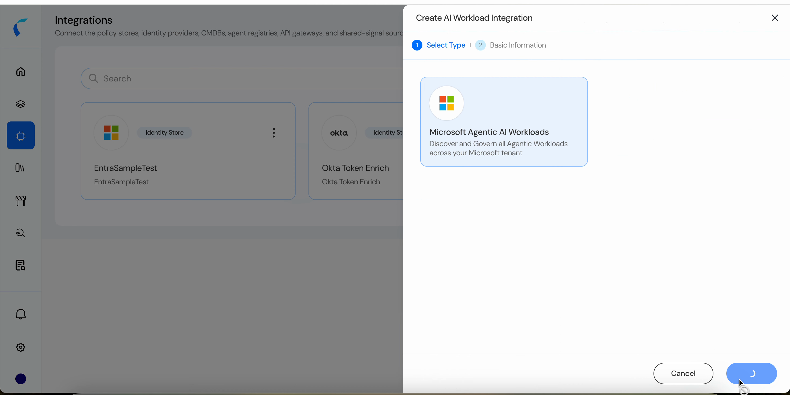
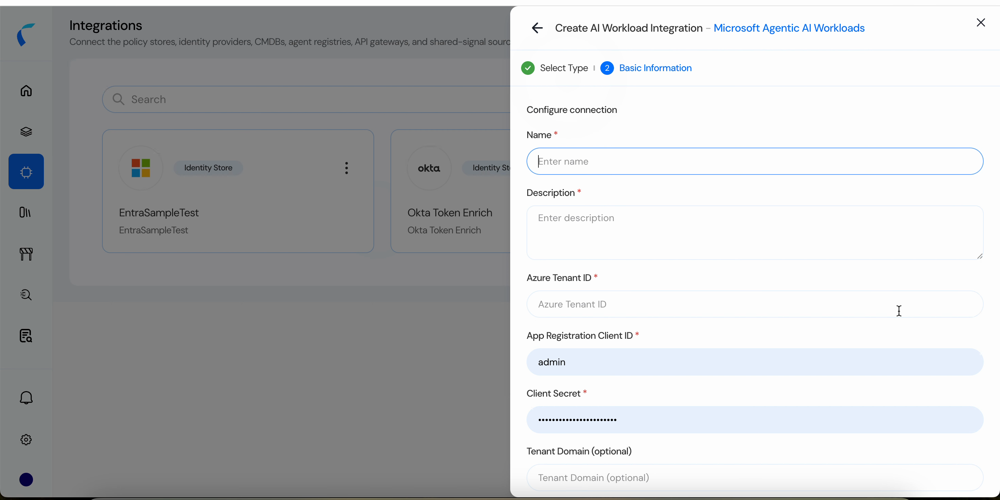
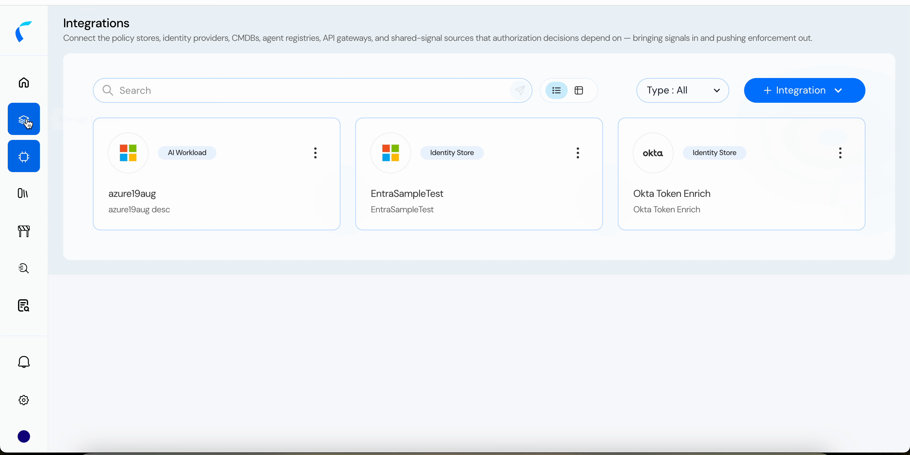
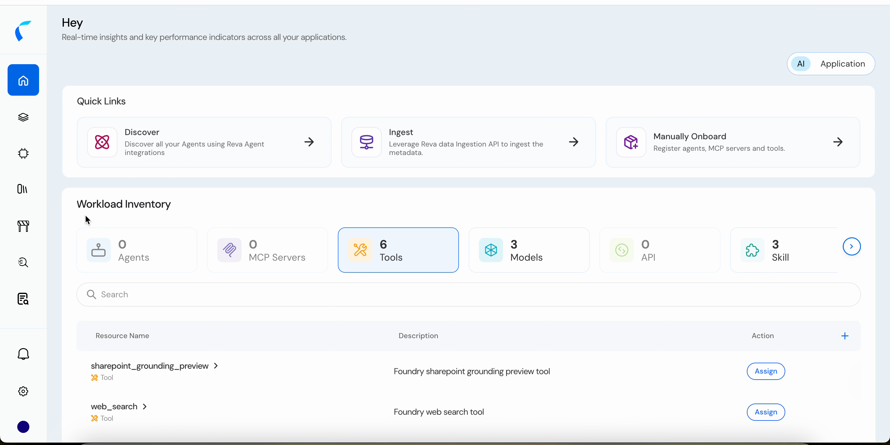
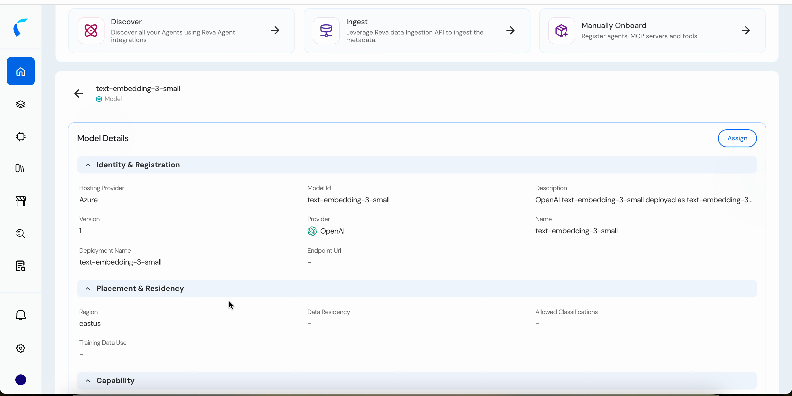

The **Microsoft Agentic AI Workloads** integration connects Reva to your Microsoft tenant and automatically discovers the agentic estate — Entra Agent Identities, Azure AI Foundry agents and projects, models, tools, and skills. Everything it finds lands in your [Workload Inventory](/ai-workload-getting-started), ready to be assigned to a policy store and governed.

This is the **Discover** path into Reva. The alternatives are **Ingest** (push entities via the Data Ingestion API) and **Manually Onboard**.

## How It Works

Reva connects as an **Entra app registration** using the OAuth 2.0 **client credentials** flow, then reads your tenant through Microsoft Graph and Azure Resource Manager. Discovery is **read-only** — Reva never modifies your Microsoft resources.

## Prerequisites

| Requirement | Description |
|:------------|:------------|
| **Reva access** | Permission to create and manage integrations in Reva. |
| **Entra app registration** | An app registration in the tenant you want to discover, with a **client secret**. |
| **Admin consent** | All Microsoft Graph permissions below are **application** permissions and require administrator consent. |
| **Azure RBAC** | **Reader** on every subscription that contains resources you want discovered. |

You'll need the app registration's **Directory (tenant) ID**, **Application (client) ID**, and **client secret** value.

## Required Permissions

### Microsoft Graph — application permissions

All are **application** permissions (client credentials) and require **admin consent**.

| Permission | What it enables |
|:-----------|:----------------|
| `AgentIdentity.Read.All` | Discover **Entra Agent Identity** objects. |
| `AgentIdentityBlueprint.Read.All` | Discover **Agent Identity Blueprints** and related blueprint information. |
| `Application.Read.All` | Read applications, service principals, workload identities, credential metadata, and app-role relationships. |
| `AppCatalog.Read.All` | Read the Teams app catalog to identify **declarative / Copilot-enabled** applications. |
| `Directory.Read.All` | Required for OAuth delegated-permission discovery (`/oauth2PermissionGrants`). |
| `RoleManagement.Read.Directory` | Read Entra directory role definitions used for identity governance. |
| `CopilotPackages.Read.All` | Read the **Agent 365 / M365 Copilot** package catalog — supported hosts, element type, platform, and package metadata. |

### Azure RBAC roles

| Role | Scope | What it enables |
|:-----|:------|:----------------|
| **Reader** | Every in-scope subscription, resource group, or Foundry resource | Discover subscriptions, resource groups, Foundry / Cognitive Services accounts, projects, and deployments; read role assignments and role definitions. |
| **Foundry project data-plane read** | Each Foundry project containing agents | Read agents and agent details from Foundry projects. |
| **Monitoring Contributor** *(optional)* | Subscription with a Log Analytics workspace | Only needed to **create diagnostic settings** (`Microsoft.Insights/diagnosticSettings/write`). **Not required** for read-only agent discovery. |

<Warning>
  **Reader must cover every subscription** containing Foundry resources you want discovered. If a subscription isn't visible to the service principal, its Foundry accounts, projects, and agents won't be discovered.
</Warning>

<Note>
  **Agent 365 / Microsoft 365 Copilot catalog discovery** — packages, supported hosts (Copilot, Teams, M365, Outlook), agent element type, and platform (Copilot Studio, M365 Copilot Agent Builder) — additionally requires **Agent 365 / applicable Microsoft 365 agent licensing** to be enabled, plus `CopilotPackages.Read.All`.
</Note>

## Create the Integration

<Steps>
  <Step title="Open Integrations">
    Go to **Integrations** and click **+ Integration**, then choose the **AI Workload** type.
  </Step>
  <Step title="Select Microsoft Agentic AI Workloads">
    On **Select Type**, choose **Microsoft Agentic AI Workloads** — *Discover and Govern all Agentic Workloads across your Microsoft tenant* — and click **Next**.

    <Frame caption="Select the Microsoft Agentic AI Workloads connector.">
      
    </Frame>
  </Step>
  <Step title="Configure the connection">
    On **Basic Information**, enter the connection details.

    | Field | Required | Description |
    |:------|:---------|:------------|
    | **Name** | Yes | A unique name for this integration. |
    | **Description** | Yes | A short description of the connection. |
    | **Azure Tenant ID** | Yes | The Directory (tenant) ID of the tenant to discover. |
    | **App Registration Client ID** | Yes | The Application (client) ID of the app registration. |
    | **Client Secret** | Yes | The client secret value for that app registration. |
    | **Tenant Domain** | No | Your tenant domain, if you want to record it. |

    <Frame caption="Configure the connection to your Microsoft tenant.">
      
    </Frame>

    <Warning>
      The client secret is a credential. Rotate it in Entra on your normal schedule, and update the integration when you do.
    </Warning>
  </Step>
  <Step title="Finish">
    Click **Finish**. The integration appears on the Integrations page with an **AI Workload** type badge, and discovery begins.

    <Frame caption="The connected integration, tagged AI Workload.">
      
    </Frame>
  </Step>
</Steps>

## What Gets Discovered

Discovered entities populate the **Workload Inventory** on the AI home, counted by type — **Agents**, **MCP Servers**, **Tools**, **Models**, **API**, and **Skill**.

<Frame caption="Discovered Foundry tools, models, and skills in the Workload Inventory.">
  
</Frame>

Each entity arrives with the metadata Reva could read from Microsoft, so you can write policy against it immediately. For a model, that includes its hosting provider, provider and deployment name, region, and capability:

<Frame caption="A discovered model, with its Azure hosting and placement metadata.">
  
</Frame>

Depending on the entity type, discovery also captures:

- **Identity & Registration** — id, name, description, version, provider, deployment name, endpoint.
- **Placement & Residency** — region, data residency, allowed classifications.
- **Usage** — which agents use the entity, what it grants access to, and last-active signals.
- **Access & Entitlement** — permissions and roles.
- **Credential** — whether a secret exists, its source, rotation policy, delegation mode, authentication method, OAuth flows, and token validity.

## Govern What You Discover

Discovered entities start **unassigned**. From the inventory, click **Assign** on an entity to add it to a policy store — the first store an entity is assigned to becomes its **owner**. From there you build the topology and author policies as usual.

<CardGroup cols={2}>
  <Card title="Assign and Govern" icon="layer-group" href="/ai-workload-getting-started">
    The inventory, assignment, and ownership model end to end.
  </Card>
  <Card title="Create an Agentic Policy Store" icon="folder-plus" href="/ai-workload-create-policy-store">
    Create the store that will own and govern these agents.
  </Card>
</CardGroup>
