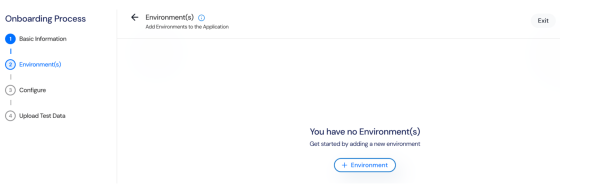
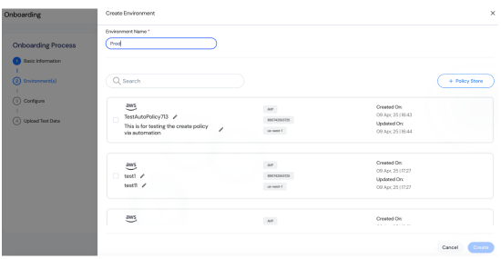

Link the application to its operational environments (e.g., Development, QA, Production) to ensure proper infrastructure association. Choose to create a new policy store or select an existing one for each environment to enforce access controls.  
### Begin by linking the environments where the application will operate.  
  
1. **Click Add Environment**  
   Click **Add Environment** to start adding a new environment. This allows you to associate specific infrastructure details with the application.  
### Create a New Environment

  
1. **Enter the Environment Name**  
   Enter the Environment Name (e.g., "Prod"). Use meaningful names like "Development", "QA", or "Production" for easy identification.  
2. **Choose Policy Store Option**  
   Choose whether to **Create a New Policy Store** or **Select an Existing Policy Store**.
   - To use an existing store, select it from the list.
   - To create a new one, click the **+ Policy Store** in the top-right corner.
