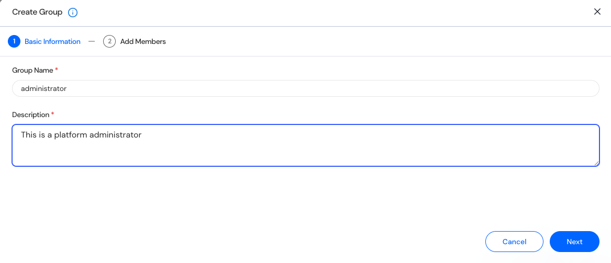
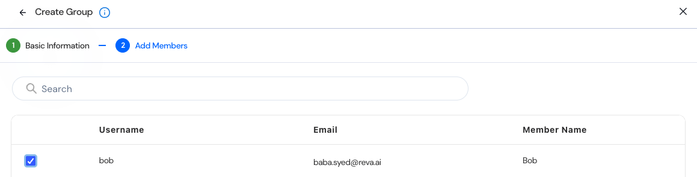

The User and Group Management module allows administrators to create and manage groups.  

## Access to Group management
1. Navigate to the Settings section via the left sidebar. 
2. Select Users and Groups under the Settings menu. 
3. Select the Groups tab. 

## View and Manage Groups 

The User and Group Management page includes tabs for: 
1. Users: Lists all registered users. 
2. Groups: Manage logical user groupings. 

| Column        | Description |
| ------------- | ----------- |
| **Name**      | Display group name (e.g., administrator) |
| **Description** | (e.g., This is a platform administrator). |
| **Created On** | User’s family or surname. |

You can search by group name, click on a group name to add or remove members, or use the “+ Group" button to create a new group. 

## Create a Group  
1. Click on “+ Group” 
2. Basic Information  

-  **Group Name**: Input field for group name (e.g., administrator) 
-  **Description**: Text area for purpose (e.g., This is a platform administrator). 
-  Click on **Next** 
4. Add Members to the group (Add users who should belong to this group) 

5. Click on **Add** to Complete the Group Creation. 
