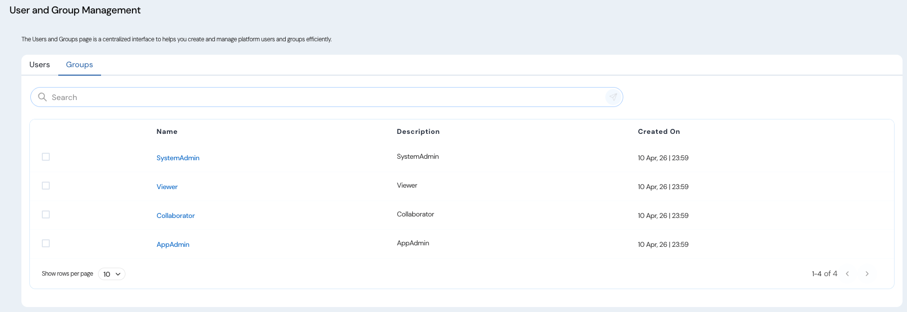

The User and Group Management module enables administrators to organize users into logical groups that drive authorization across the platform.  

Groups are used to:  
1. Assign role-based access (AppAdmin, Collaborator, SystemAdmin, Viewer)  
2. Simplify policy evaluation  
3. Enable scalable access control without managing permissions per user  

## Predefined Groups  
The platform provides four predefined groups:  
| Group                     | Description                                                                                                |
| ------------------------- | ---------------------------------------------------------------------------------------------------------- |
| **AppAdmin**              | policy store level administrators with full control over policy stores, and selected settings |
| **Collaborator (Editor)** | Users who can contribute to and manage policy stores and related resources                                 |
| **SystemAdmin**           | Platform administrators with control over system-wide settings and administrative configurations           |
| **Viewer**                | Read-only users with limited operational capabilities                                                      |

## Role-Based Access Summary  
1. **AppAdmin**
   Full access to:  
     - Policy Store  creation and management 
     - Policy Store management (data, schema, insights, version history)  
     - Selected settings (Category Management, Onboarding, Access Explorer)  
   Can perform:
     - Create, edit, delete, and manage policies and data
   Cannot:
     - Manage all system settings globally
2. **Collaborator (Editor)**
   Can:
     - Manage policy store (if part of group or assigned as editor/owner)
     - Create drafts, edit data, manage schema, insights, and versions
     - Access and manage onboarding workflows
     - Manage Access Explorer
   Access is:
     - Scoped to policy store where they are assigned (editor)
3. **SystemAdmin**
   Full control over:
     - All Settings (including SSO, authorization, user/group management)
   Can:
     - View and manage users and groups
     - Configure platform-level capabilities
   Does NOT:
     - Automatically get access to policy store (except special cases)
     - Participate in policy authoring workflows by default
4. **Viewer** 
   Can:
     - View Portfolio, policy store, data, schema, and insights
     - Access onboarding workflows
     - Manage Access Explorer
   Cannot:
     - Modify data, schema, policy store, or portfolio

## Access to Group management
1. Navigate to the Settings section via the left sidebar. 
2. Select Users and Groups under the Settings menu. 
3. Select the Groups tab. 

## Manage Group Membership 
Administrators (SystemAdmin role) can manage group membership through the Groups interface.  
### Add a User to a Group
1. Navigate to User and Group Management → Groups
2. Click on the Group Name
3. Click on "**+ Member**"
4. Select the user from the list
5. Click **Add**  

### Remove a User from a Group
1. Navigate to User and Group Management → Groups
2. Click on the Group Name
3. Select the user you want to remove
4. Click on "**– Member**"
5. Click **Remove**  
