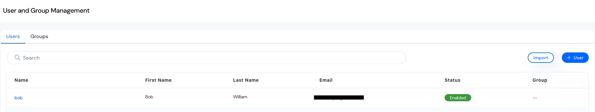
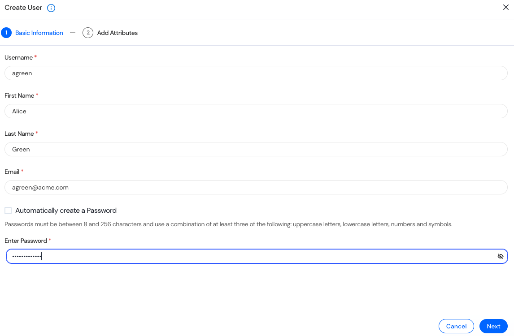
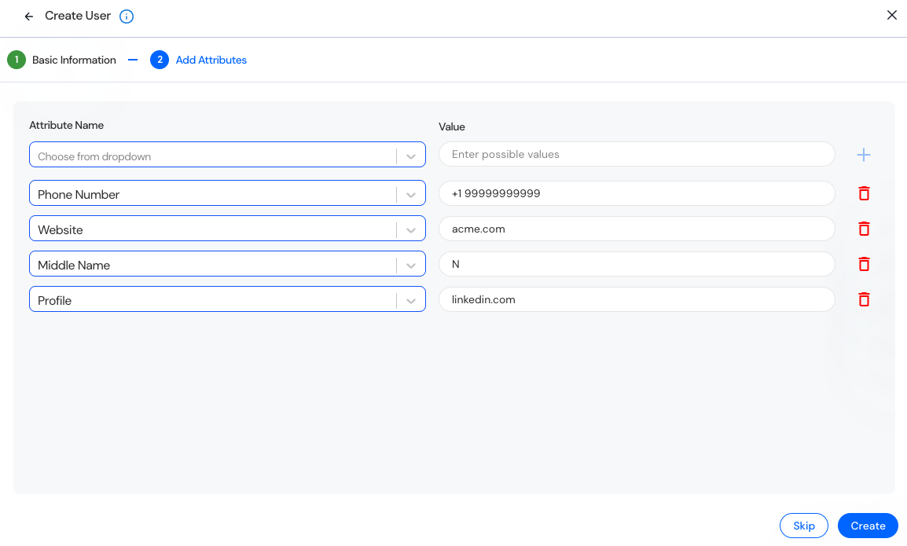
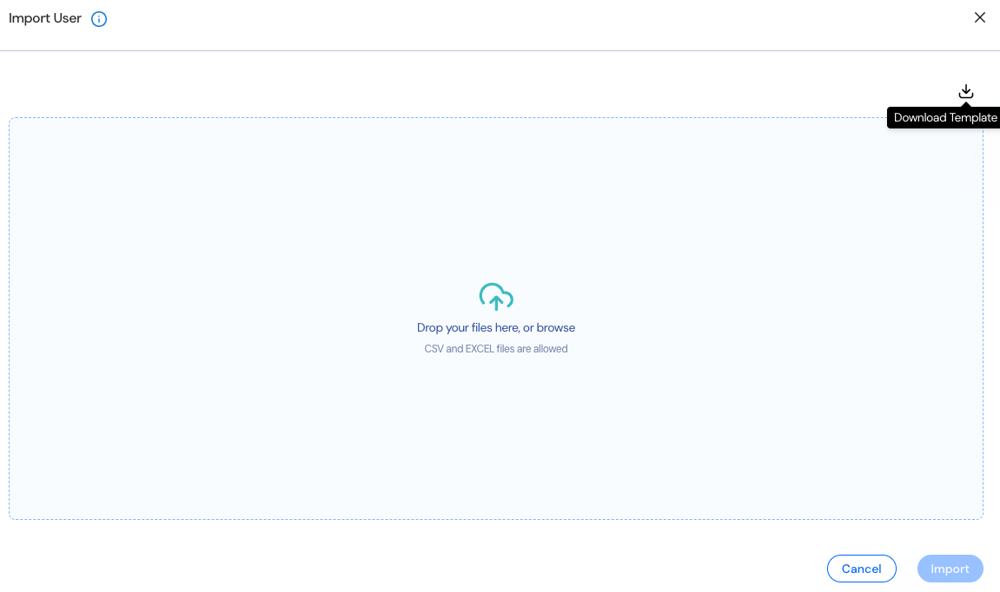

The User and Group Management module allows administrators to onboard, manage, and configure user accounts individually or in bulk using CSV/Excel templates. 

<Info>Local user creation and management are currently supported. Support for SSO-based user provisioning and authentication will be introduced in an upcoming release.</Info>

## Access to User management  
1. Navigate to the Settings section via the left sidebar. 
2. Select Users and Groups under the Settings menu. 
3. Select the Users tab. 

## View and Manage Users

The User and Group Management page includes tabs for:   
1. Users: Lists all registered users. 
2. Groups: Manage logical user groupings. 

| Column | Description |
| ----------- | ----------- |
| **Name**    | Display username with which the user can login |
| **First Name** | User’s given name. |
| **Last Name**  | User’s family or surname. |
| **Email** | Registered email address used for communication and login. |
| **Status** | Indicates whether the user account is Enabled or Disabled. |
| **Group** | Displays the user’s assigned group or role classification. |

You can search for users, click on a user to edit, or use the + User button to create a new user. Optionally, click Import to bulk upload users via CSV. 

## Create a User  
1. Click on “+ User” 
2. Basic Information

- **Username**  
  A unique identifier for the user (e.g., agreen). This will be used for login and user      management. 
- **First Name**
  The user’s given name. 
- **Last Name**
  The user’s family or surname. 
- **Email**
  The user’s registered email address is used for login and notifications. 
- **Password:** Either manually set or auto-generated 
  You can either manually set a password or allow the system to auto-generate one.  
  Password Requirements:  
  - Minimum of 13 characters 
  - Must include: 
    - Uppercase letters 
    - Lowercase letters 
    - Numbers 
    - Special symbols 
3. Add Attributes (Optional)  

-  **Phone Number**
   Enter the user’s contact number, including the country code (e.g., +1 617 555 1234).  
-  **Website**
   Provide the user’s professional or company website. 
-  **Middle Name**
   To record the user's middle name, it is useful for distinguishing users with similar names. 
-  **Profile** (e.g., LinkedIn URL)
   Include a link to the user's public profile, such as LinkedIn. 
4. Click **Create** to complete the user registration process in the Reva Platform. 

## Bulk Import Users

Download a template for bulk user creation.  
1. A modal allows you to: 
- Drag and drop a CSV/Excel file. 
- Download a template for bulk user creation. 
2. Supported file types: .csv 

| Column        | Requirement | Description |
| ------------- | ----------- | ----------- |
| **username**  | Required    | Unique identifier (e.g., jsmith) |
| **email**     | Required    | Registered email address used for communication and login. |
| **first_name**| Required    | User's given name “Alice” |
| **last_name** | Required    | User's family name “Green” |
| **generate_password** | Optional | Set to true for auto-generated passwords |
| **password**  | Conditional | Required if generate_password=false; ignored if generate_password=true |
| **phone_number** | Optional  | Include country code (e.g., +16175551234) |
| **website**   | Optional    | Full URL (e.g., https://acme.com) |
| **middle_name** | Optional  | User’s middle name “Webber” |
| **profile**   | Optional    | Social media URL (e.g., linkedin.com/in/jane-doe) |
