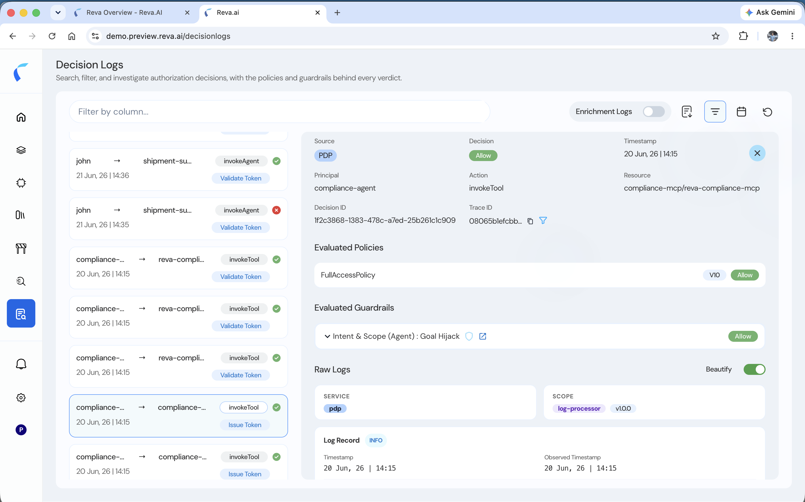
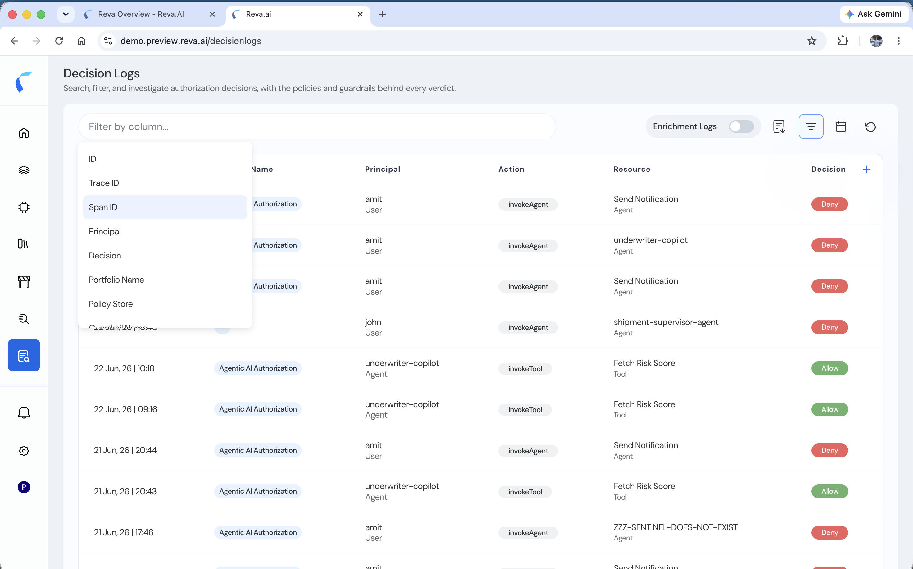
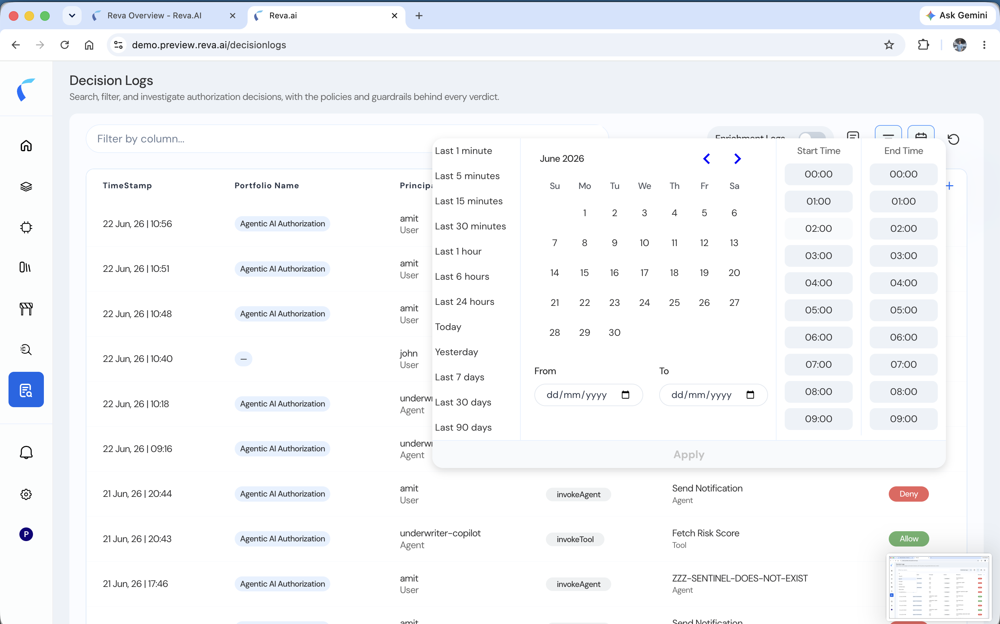

Decision Logs record **every authorization decision Reva makes** — allow or deny — across all your policy stores. Each entry captures who acted, what they tried to do, the verdict, and the **policies and guardrails** behind it, so you can audit and investigate with full context.

Decision Logs are available in two places:

- **Globally** — the platform-wide Decision Logs view aggregates decisions across every policy store and use case (custom applications, AI workloads, and token enrichment).
- **Per policy store** — each policy store has its own **Decision Logs** tab showing just that store's decisions.

## What's in a Decision Log

| Field | Description |
|:------|:------------|
| **Timestamp** | When the decision was made |
| **Portfolio / Policy Store** | The application or agent workload the decision belongs to |
| **Principal** | Who acted — a `User` or `Agent` |
| **Action** | The attempted operation (`invokeAgent`, `invokeTool`, …) |
| **Resource** | What was acted on — an Agent, Tool, MCP server, Model, or API |
| **Decision** | **Allow** or **Deny** |
| **Trace ID · Span ID · Decision ID** | Correlation ids for following a request across hops |
| **Token status** | Whether a transaction token was issued or validated for the hop |

## Open Decision Logs

1. From the left navigation, open **Decision Logs** for the platform-wide view — or open a **policy store → Decision Logs** tab for a single store.
2. The list shows the most recent decisions. Select any row to investigate it.

## Investigate a Decision

Selecting a decision opens a detail panel with the full context behind the verdict:

<Frame caption="A decision's detail panel — evaluated policies, evaluated guardrails, and raw logs.">
  
</Frame>

- **Source & Decision** — the deciding component (the Reva Trust Guardian / PDP) and the Allow or Deny result.
- **Principal · Action · Resource** — exactly what was evaluated.
- **Decision ID · Trace ID · Span ID** — copy or filter by these to follow the request.
- **Evaluated Policies** — which policies ran, their version, and each verdict (e.g., `FullAccessPolicy` v10 → Allow).
- **Evaluated Guardrails** — which guardrails ran and their verdict (e.g., *Intent & Scope (Agent): Goal Hijack*, *Prompt Injection Detector*).
- **Raw Logs** — the underlying log record; toggle **Beautify** for a formatted view.

## Filter and Search

Narrow the list to the decisions you care about:

<Frame caption="Filter by any column — Trace ID, Principal, Decision, Portfolio, Policy Store, and more.">
  
</Frame>

- **By column** — Trace ID, Span ID, Decision ID, Principal, Decision, Portfolio Name, or Policy Store.
- **By time range** — last 5 / 15 / 30 minutes, 1 / 4 / 24 hours, today, yesterday, last 7 / 30 / 90 days, or a custom start and end.

<Frame caption="Scope decisions to a time range.">
  
</Frame>

## Trace an Agent Chain

Every hop of a single request shares a **Trace ID**. Filter by a Trace ID (from a row or the detail panel) to reconstruct the whole chain end to end — for example:

| timestamp | principal | type | action | resource | decision |
|:----------|:----------|:-----|:-------|:---------|:---------|
| 12:11:02 | john | User | invokeAgent | shipment-supervisor-agent | Allow |
| 12:11:02 | shipment-supervisor-agent | Agent | invokeTool | reva-carrier-mcp | Allow |
| 12:11:05 | shipment-supervisor-agent | Agent | invokeAgent | compliance-agent | Allow |
| 12:11:08 | compliance-agent | Agent | invokeTool | reva-compliance-mcp | Deny |

The final **Deny** shows exactly where and why the chain was stopped.

## Enrichment Logs

Toggle **Enrichment Logs** to switch from access decisions to **token enrichment** decisions — the claims Reva returned during token issuance. See [Token Enrichment](/enrich-identity-tokens-with-policy-based-claims).
