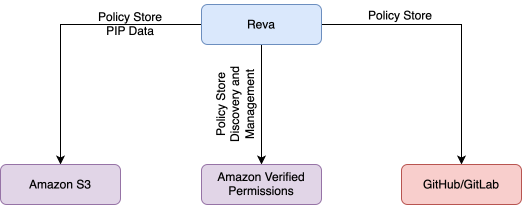

Centralized policy management across your ecosystem 

## Core Integration Roles

| **Platform**     | **Primary Function**                    | **Lifecycle Stage**     |
|:-----------------|:----------------------------------------|:-------------------------|
| **GitLab/GitHub** | Policy distribution & versioning        | Distribution             |
| **Amazon S3**     | Policy orchestration & PIP data storage | Storage / Enforcement    |
| **Amazon AVP**    | Policy evaluation & enforcement          | Runtime                  |

## GitLab Integration 

Version-controlled policy distribution

**How it works:**

- Design policies in Reva, creating a centralized location for policy authoring.
- Sync policies to GitLab repositories, making them version-controlled for easier management.
- Collaborate via merge requests, ensuring proper review and changes before deployment.
- Automatically sync approved changes back to Reva for seamless policy updates.

**Key Features:**

- Merge-based collaboration allows teams to work together efficiently on policy updates.
- Full Git commit history tracking provides full traceability of policy changes.
- CI/CD pipeline compatibility ensures policies can be integrated into continuous delivery workflows.

## GitHub Integration 

Git-based policy workflow

**How it works:**

- Design policies in Reva, authoring policies within a central management tool.
- Sync policies to GitHub repositories, benefiting from version control and secure storage.
- Collaborate via merge requests to maintain control and quality of policy changes.
- Automatically sync approved changes back to Reva, ensuring Reva is up to date.

**Key Features:**

- Merge-based collaboration streamlines the policy development process within GitHub.
- Full Git commit history tracking enhances visibility and traceability of policy changes.
- CI/CD pipeline compatibility allows policy management within existing DevOps pipelines.

## Amazon S3 Integration 

Policy orchestration & PIP data hub

**Dual Purpose:**

- **Policy Orchestration:**  
   - Store and version policies in S3 buckets, making them easily retrievable and manageable.  
   - Enable cross-environment promotion, ensuring policies are consistently applied across environments.  
   - Provide backup and restore capabilities, adding redundancy to your policy storage.
  
- **PIP Data Storage:**  
   - S3 acts as a central repository for authorization data, simplifying management.  
   - Stores entity relationships (e.g., users, resources) for efficient access control management.  
   - Supports hierarchical data caching for faster access and decision-making.

**Key Features:** 

- Event-driven updates using S3 event notifications trigger updates or alerts automatically.
- Serverless scalability allows for automatic scaling to meet demands without manual intervention.
- Encryption and IAM access controls ensure security and restricted access to policy data.
- Mountable via EFS for AVP to extend the system's functionality to Amazon Verified Permissions.

## Amazon Verified Permissions (AVP) Integration 

Full policy lifecycle management

**How it works:**

- Create policies in Reva, setting up centralized policy definitions.
- Sync policies to AVP policy stores, enabling enforcement within the AWS ecosystem.
- AVP evaluates real-time access requests, determining if policies allow or deny specific actions.
- Decision logs are fed back to Reva, ensuring complete visibility of access control decisions.

**Key Features:**

- End-to-end policy governance ensures that policies are consistently enforced across the lifecycle.
- Cedar-based policy enforcement at scale, leveraging AWS's powerful policy evaluation capabilities.
- CloudTrail integration for auditing ensures compliance and traceability of decisions.
- Auto-scaling decision engine adapts to traffic spikes, maintaining performance during high demand.

## Why These Integrations Matter 

- **Developer Workflow Alignment:**  
   - Use familiar Git processes for policy changes, making it easier for developers to integrate policy management into their workflows.

- **Secure Data Handling:**  
   - S3 provides durable PIP storage with encryption, ensuring your policy and authorization data is protected.

- **Cloud-Native Enforcement:**  
   - AVP delivers AWS-scale authorization, allowing for highly efficient and scalable policy enforcement.

- **End-to-End Traceability:**  
   - Track policy from code commit to enforcement, giving you complete visibility over the policy lifecycle and changes.

<Info>**Tips:** Use S3 as your central PIP data lake to maintain consistency across AVP policy stores and local PDP evaluations.</Info> 