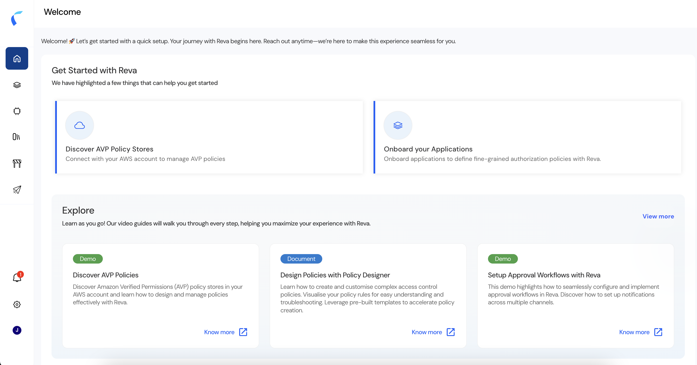

The Reva Home page is your landing dashboard — **real-time insights and key performance indicators across all your applications**. From here you can jump into setup, review your workloads, and open decision logs.

## Application and AI Views

The Home page has two views, toggled at the top right:

| View | Best for | Shows |
|:-----|:---------|:------|
| **Application** | Custom application authorization | Get-started tiles for AVP policy stores and application onboarding, plus learning resources. |
| **AI** | Agentic AI / AI workload security | Your agentic workload inventory — agents, MCP servers, tools, and models — or a prompt to onboard them if none exist yet. |

## Application View

The Application view helps you set up custom application authorization.

| Tile | Purpose | Takes you to |
|:-----|:--------|:-------------|
| **Discover AVP Policy Stores** | Connect your AWS account to manage AVP policies | [Integrations](/integration-overview) |
| **Onboard your Applications** | Define fine-grained authorization policies | [Manage Policies](/manage-policies) |
| **Decision Logs** | Investigate authorization decisions | [Decision Logs](/ai-workload-decision-logs) |

The **Explore** section below offers self-paced video and document guides — discovering AVP policies, designing policies with the Policy Designer, setting up approval workflows, and more.

## AI View

The AI view is tailored to agentic AI. If your agentic workload is already populated, it shows your **inventory** — counts and a searchable table of agents, MCP servers, tools, and models. If nothing is onboarded yet, Reva prompts you to upload or onboard your agents.

A top banner offers three quick actions:

| Tile | Purpose | Takes you to |
|:-----|:--------|:-------------|
| **Discover** | Connect the sources your agents depend on | [Integrations](/integration-overview) |
| **Onboard** | Create an agentic policy store and onboard agents | [Manage Policies](/manage-policies) |
| **Decision Logs** | Investigate agent authorization decisions | [Decision Logs](/ai-workload-decision-logs) |

<Note>
  The **Decision Logs** tile appears in both the Application and AI views.
</Note>

## Get Oriented

New to the platform? See [Navigating Reva](/navigating-reva) for a map of all the main sections.
