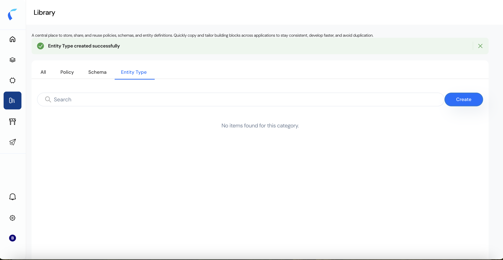
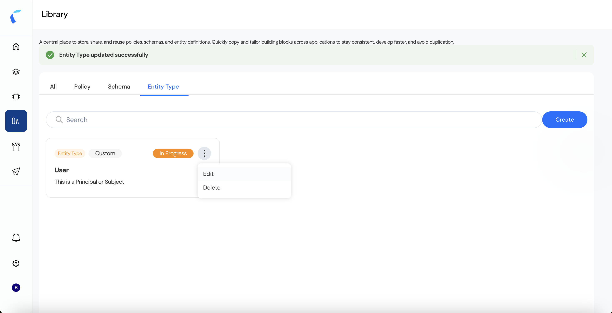

The Library in Reva is a centralized workspace to store and reuse policies, schemas, and entity definitions across applications and environments. This section explains how to create and configure an Entity Type — one of the foundational building blocks for authorization and schema modeling.  

## How to access Entity Type
Navigate to the Library 
  - Click on the Library icon in the left sidebar. 
  - Switch to the Entity Type tab or stay at All tab. 

## Steps to Create an Entity Type  
  
1. Click **Create**  if you are in Entity Type tab or Press the **+ Create** button and choose **Entity Type** from the dropdown. 
2. Enter Basic Information 
Fill in the required fields: 
   - Entity Type Name  
   - Description  
   - Optionally define Parent Entity Type or Child Entity Type  
3. Click on **Next**
4. Add Attributes 
In the Add Attributes section: 
   - Define each attribute’s Name, Type, and optionally Value.  
   - Toggle whether the field is Required.  
5. Save the Entity Type 
Click **Create** to finalize. 
   A success banner confirms the Entity Type was created successfully.

## Steps to Edit an Entity Type 
In the Entity Type tab, locate the entity you want to modify (e.g., User).  
  
1. Click the three-dot menu and choose Edit.  
2. You may update the basic information, add or remove attributes, and modify required flags.  
3. Press Update to save the changes. 

##  Fields and Descriptions 

| **Field**              | **Description**                                                               |
|:---------------------- |:----------------------------------------------------------------------------- |
| **Entity Type Name**   | A unique identifier for the entity type (e.g., `User`, `Service`, `Device`)   |
| **Description**        | A brief explanation of the purpose or scope of this entity type               |
| **Parent Entity Type** | (Optional) A higher-level entity this one inherits from                       |
| **Child Entity Type**  | (Optional) A lower-level entity that inherits from this one                   |
| **Attribute Name**     | Name of the field associated with the entity (e.g., `role`, `department`)     |
| **Attribute Type**     | The data type of the attribute (e.g., String, Boolean, Integer, Enum, etc.)   |
| **Value**              | (Optional) Predefined accepted values for the attribute                       |
| **Required**           | A toggle to enforce whether this attribute is mandatory during schema binding |

<Info>Building Policies and Schemas in the Library depends on predefined Entity Types. Ensure Entity Types are defined before linking them in schemas or policies.</Info>  
    

