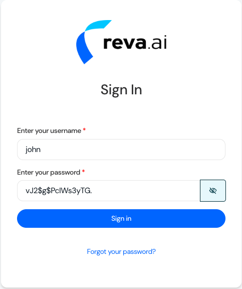
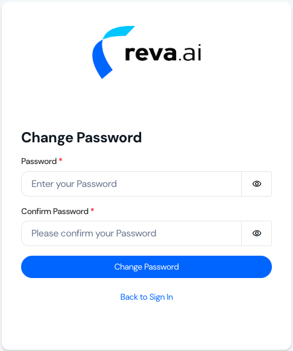

Follow these steps to access your Reva account: 

## Receive Your Welcome Email

After your organization's tenant is created in Reva's SaaS Platform, you'll receive a welcome email from no-reply@reva.ai containing:  
- **Login URL**  
- **Username**  
- **Temporary password**  

<Info>The temporary password expires in 7 days.</Info>

## First-Time Login

1. **Click the URL** in your welcome email.  
2. **Enter your credentials:**  
     
   - **Username (provided in the email)**   
   - **Temporary password (provided in the email)**
3. **Create a new password when prompted:**
   
   - **Enter your new password**
   - **Confirm it**

<Info>Use a strong password that meets Reva's security requirements.</Info>

## Access Your Dashboard  
After resetting your password, you'll be automatically redirected to the Reva Home Page - your central hub for policy governance and authorization management. 

## Troubleshooting

1. Expired password? Contact support@reva.ai to request a new welcome email.  
2. Forgot password? Use the "Forgot Password" link on the login page.  

<Info>Tip: If you want to <a href="create-manage-user" className="text-blue-600 font-semibold">Add More Users</a> </Info>