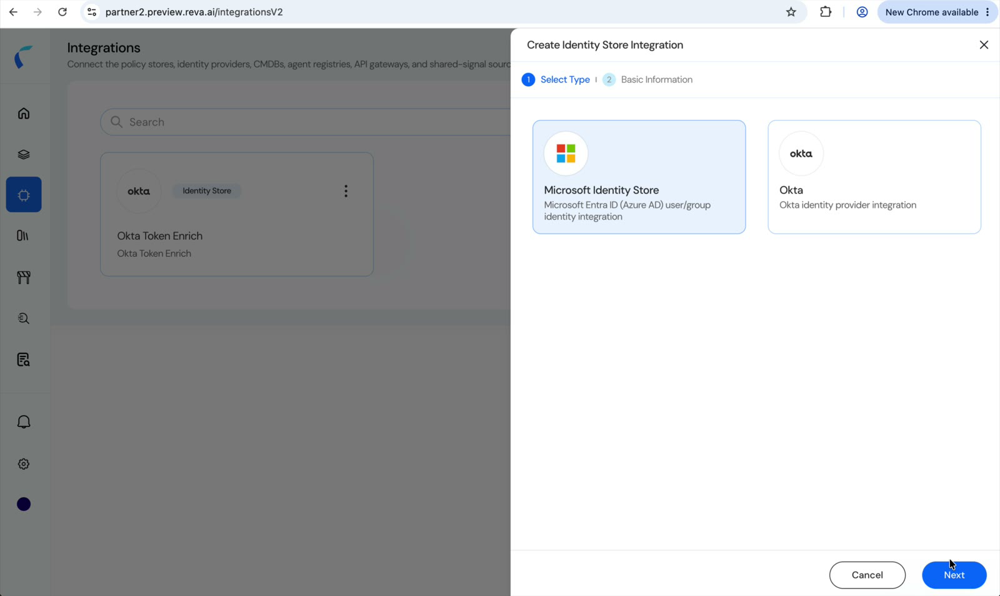
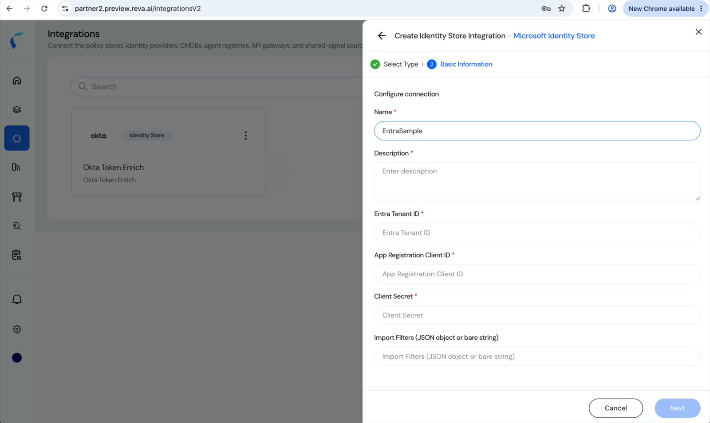
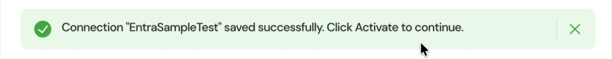
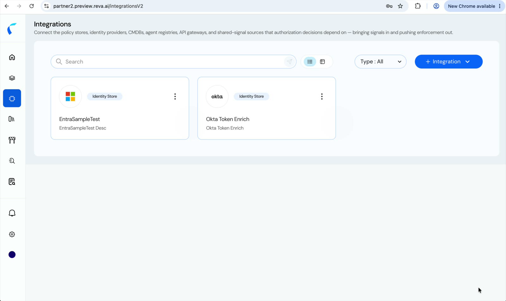
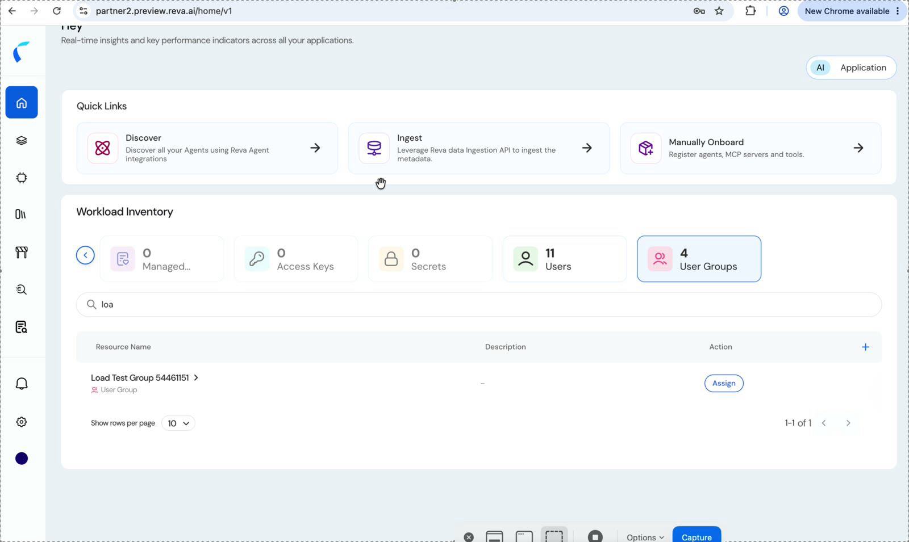

The **Microsoft Identity Store** integration connects Reva to your **Microsoft Entra ID (Azure AD)** tenant and imports your **users** and **groups**. Those identities land in your inventory as entities, so your policies can name real people and real groups instead of placeholders.

Reva groups its connectors into three integration types. This is an **Identity Store** connector:

| Integration type | What it connects | Examples |
|:-----------------|:-----------------|:---------|
| **Identity Store** | The directory your users and groups come from | **Microsoft Entra ID**, [Okta](/okta-identity-integration) |
| **AI Workload** | The agentic estate you want discovered and governed | [Microsoft Agentic AI Workloads](/azure-agent-integration) |
| **Policy Store** | External policy stores Reva manages | [Amazon Verified Permissions](/avp-integration) |

## How It Works

Reva authenticates to your tenant as an **Entra app registration** using the OAuth 2.0 **client credentials** flow, then reads users and groups through **Microsoft Graph**. The import is **read-only** — Reva never writes back to your directory.

You can narrow what gets imported with **import filters**, so you bring in only the users and groups you actually intend to govern.

## Prerequisites

| Requirement | Description |
|:------------|:------------|
| **Reva access** | Permission to create and manage integrations in Reva. |
| **Entra app registration** | An app registration in the tenant you want to import from, with a **client secret**. |
| **Graph permissions** | **Application** permissions that allow reading users and groups, granted with **administrator consent**. |

You'll need the app registration's **Directory (tenant) ID**, **Application (client) ID**, and **client secret** value.

<Note>
  Because the connector uses **client credentials**, every Microsoft Graph permission it relies on is an **application** permission and requires **admin consent** — the same consent model as the [Microsoft Agentic AI Workloads](/azure-agent-integration) connector.
</Note>

## Create the Integration

<Steps>
  <Step title="Start a new Identity Store integration">
    Go to **Integrations**, click **+ Integration**, and choose **Identity Store**.
  </Step>
  <Step title="Select Microsoft Identity Store">
    On **Select Type**, choose **Microsoft Identity Store** — *Microsoft Entra ID (Azure AD) user/group identity integration* — then continue.

    <Frame caption="Choose Microsoft Identity Store on the Select Type step.">
      
    </Frame>
  </Step>
  <Step title="Configure the connection">
    On **Basic Information**, fill in the connection details.

    | Field | Required | Description |
    |:------|:---------|:------------|
    | **Name** | Yes | A unique name for this integration. |
    | **Description** | Yes | A short description of the connection. |
    | **Entra Tenant ID** | Yes | The Directory (tenant) ID of the tenant to import from. |
    | **App Registration Client ID** | Yes | The Application (client) ID of the app registration. |
    | **Client Secret** | Yes | The client secret value for that app registration. |
    | **Import Filters** | No | Limit which users and groups are imported — see [Import Filters](#import-filters). Leave empty to import everything. |

    <Frame caption="Configure the connection to your Entra tenant.">
      
    </Frame>

    <Warning>
      The client secret is a credential. Rotate it in Entra on your normal schedule, and update the integration when you do.
    </Warning>
  </Step>
  <Step title="Save, then activate">
    Save the connection. Reva confirms it was saved and prompts you to activate.

    <Frame caption="Reva confirms the connection was saved.">
      
    </Frame>

    Click **Activate** to enable the integration and start the import.
  </Step>
  <Step title="Confirm it's connected">
    The integration appears on the **Integrations** page with an **Identity Store** badge.

    <Frame caption="The connected Entra integration, tagged Identity Store.">
      
    </Frame>
  </Step>
</Steps>

## Import Filters

**Import Filters** control which identities Reva pulls in. The field takes a **JSON object** with a `users` key, a `groups` key, or both. Each value is a **Microsoft Graph OData filter expression**, so any filter Graph accepts for users or groups works here.

| Use case | Filter |
|:---------|:-------|
| All users and all groups | `{}` — or leave the field empty |
| Active users only | `{"users": "accountEnabled eq true"}` |
| Mail-enabled groups | `{"groups": "mailEnabled eq true"}` |
| A specific user | `{"users": "userPrincipalName eq 'user@domain.com'"}` |
| A specific group | `{"groups": "displayName eq 'Group Name'"}` |
| A specific user **and** group | `{"users": "userPrincipalName eq 'user@domain.com'", "groups": "displayName eq 'Group Name'"}` |

<Tip>
  Start narrow. Filter to the users and groups you intend to govern first, confirm they arrive as expected, then widen the filter — it keeps your inventory meaningful and your first import quick.
</Tip>

## What Gets Imported

Imported identities appear in the **Workload Inventory** on the AI home, counted by type — including **Users** and **User Groups**.

<Frame caption="Imported users and groups in the Workload Inventory, each with an Assign action.">
  
</Frame>

Each imported identity starts **unassigned**. Click **Assign** to add it to a policy store — from there it's available as a principal in your policies, so you can write rules such as *which users may invoke an agent* or *which group a delegated action must belong to*.

## Related

<CardGroup cols={2}>
  <Card title="Okta Identity Integration" icon="key" href="/okta-identity-integration">
    Connect Okta as your identity store instead of, or alongside, Entra.
  </Card>
  <Card title="Microsoft Agentic AI Workloads" icon="robot" href="/azure-agent-integration">
    Discover agents, tools, and models across the same Microsoft tenant.
  </Card>
  <Card title="Assign and Govern" icon="layer-group" href="/ai-workload-getting-started">
    The inventory, assignment, and ownership model end to end.
  </Card>
  <Card title="Design Policies" icon="shield-halved" href="/ai-workload-policy-design">
    Reference these users and groups in on-behalf-of and context policies.
  </Card>
</CardGroup>
