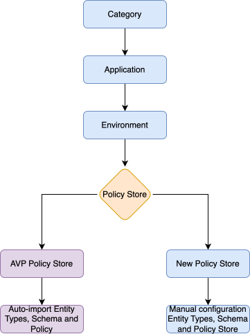
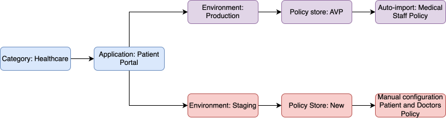

Organizing your authorization environment from business domains to enforcement 

## Hierarchy Levels 

1. **Category**  
   Business domain grouping  
   - **Purpose:** Organize applications by function or governance needs.  
   - **Example:** Healthcare, Financial  
   - **Governance:** Policies inherit category-level settings 
2. **Application**  
   Your software system    
   - **Purpose:** Central unit for policy management  
   - **Structure:**  
      -  Belongs to one Category  
      -  Contains multiple Environments 
   - **Example:** Patient Portal App, Payment Service  
3. **Environment**  
   Deployment stage   
   - **Purpose:** Isolate access rules per deployment phase  
   - **Types:** Dev, Test, Staging, Prod   
   - **Critical Link:** Connects to one Policy Store  
4. **Policy Store**  
   Authorization policies container   
   **Function:** Stores all access policies for an environment   
   **Two Configuration Paths:**  
   -  **AVP Policy Store:** For existing Amazon Verified Permissions setups  
      -  **Auto-imports:**  
         -  Entity Types (users/resources)  
         -  Schema structure 
         -  Existing policies 
      -  **Benefits:** Zero manual setup, instant governance 
   -  **New Policy Store:** For new authorization implementations  
      -  **Manual configuration:**
         -  Define Entity Types
         -  Create custom Schema  
         -  Build policies from scratch 
      - **Flexibility:** Full control over access model design 

## Key Relationships

| **Level**       | **Parent**     | **Child**        | **Description**                              |
|----------------|----------------|------------------|----------------------------------------------|
| **Category**     | None           | Application       | Groups applications by business domain        |
| **Application**  | Category       | Environment       | Represents a service or product               |
| **Environment**  | Application    | Policy Store      | Defines deployment stages (e.g., dev, prod)   |
| **Policy Store** | Environment    | None              | Stores and enforces rules                     |

## Workflow Example: Healthcare Portal 

### Why This Structure Works 

- **Business Alignment:** Categories map to organizational units  
- **Environment Isolation:** Separate policies for dev/test/prod  
- **Flexible Integration:** Support both new and existing AVP stores 

<Info>Use AVP Policy Stores for production environments and New Policy Stores for experimental stages to maintain stability while enabling innovation.</Info>