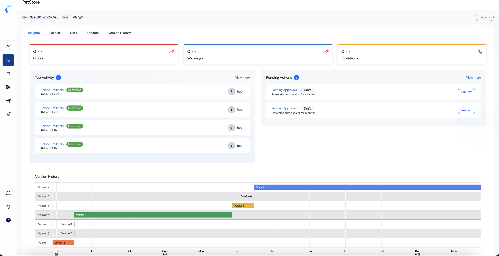

The Insights tab in Reva provides a comprehensive operational overview of your policy store, acting as a real-time control panel for governance, monitoring, and troubleshooting. By centralizing key information streams, Insights allows security and governance teams to stay informed on the current state of their policies, recent activities, pending actions, and version history.   

## Purpose of Insights  
The Insights view is designed to answer critical operational questions:  
1. Is my policy store healthy and operating correctly?  
2. Are there any pending actions that need attention?  
3. Who made recent changes and when?  
4. How has the policy store evolved over time?  
By addressing these questions, Reva enables organizations to maintain continuous governance and auditability of their authorization environment.  

## Benefits of Insights  
1. Operational Visibility: Full transparency into policy lifecycle activities.  
2. Governance Control: Enforces strong policy management discipline.  
3. Audit Readiness: Maintains traceability for compliance audits.  
4. Real-Time Monitoring: Identifies issues before they impact production environments.  

## How to navigate to Access Map
To open Access Map:  
1. Navigate to Policy Store (e.g., PetStore).  
2. Click on the Insights tab.  

## Key Sections of Insights  
    
1. Errors, Warnings, and Violations  
   - Errors: Indicates critical failures that have occurred during configuration or processing.  
   - Warnings: Surfaces with non-critical issues that may require attention to maintain optimal performance.  
   - Violations: Displays policy violations detected by guardrails checks.  
   <Info>In the absence of any issues, these metrics will show zero, indicating a clean operational state.</Info>  
2. Top Activity  
   -  The Top Activity panel provides a chronological log of recent user actions within the policy store: 
      - Uploads (e.g., Upload Entity Zip)  
      - Policy activations and deactivations  
      - Imports or configuration changes  
   -  Each activity is tagged with:  
      - Timestamp: Exact date and time of the action.  
      - User: The actor who performed the activity.  
      - Status: Whether the activity was successfully completed or failed (e.g., Completed, Failed). 
   - This audit-friendly log helps teams: 
     - Trace configuration changes.  
     - Identify who performed specific updates.  
     - Quickly troubleshoot failed operations. 
3. Pending Actions 
   - Pending actions represent open tasks that require review or approval before finalizing policy configurations: 
     - Pending Approvals: Lists draft changes waiting for governance team approval. 
     - Review Options: Direct links to review, approve, or reject pending drafts. 
   - Having this clear visibility ensures that no critical task is overlooked, helping organizations enforce strict policy governance workflows. 
4. Version History  
   - The Version History timeline delivers a visual representation of configuration changes over time:  
     - Each version is marked with:  
       - Version number  
       - Duration of deployment  
       - Timestamps for creation and activation
   - This versioned view allows teams to:  
     - Track policy evolution across days or weeks.  
     - Understand deployment cycles.  
     - Simplify rollback or audit operations.

   <Note>
   For example, in the provided screenshot:  
   - Versions 1 through 7 are tracked across multiple days.
   - You can see when versions were introduced, how long they were active, and their sequence.
   </Note>