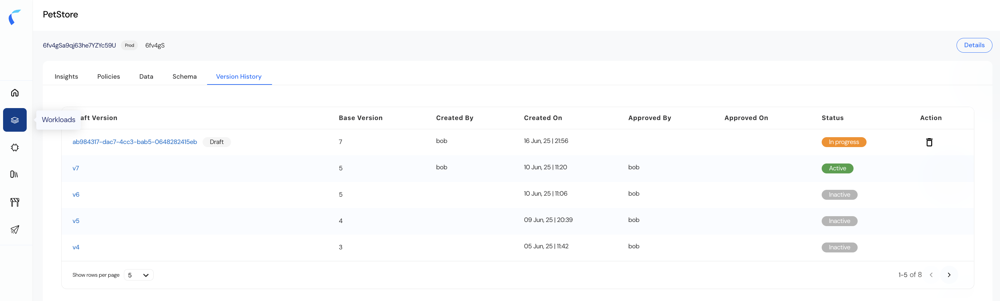

Reva allows you to effectively track, review, and manage policy versions within each Policy Store. The Version History tab provides a complete timeline of all versions, allowing teams to maintain governance, audit changes, and revert or activate specific versions as needed.  
## How to navigate to Version History  
To access the policy version history and view Access Map:  
1. Navigate to the Policy Store (e.g., PetStore).  
2. Click on the "Version History" tab.  

## Understanding the Version History Table  
The Version History table provides a structured view of all policy versions with key details:  
   

| Column| Description |
|:------|:------------|
| **Version**        | The unique identifier for the policy version. Draft versions display a generated ID while approved versions follow sequential version numbers (e.g., v7, v6, v5, etc.). |
| **Base Version**   | Indicates the parent version from which this version was derived. Helps track version lineage. |
| **Created By**     | Username of the person who created the version. |
| **Created On**     | Date and time when the version was created. |
| **Approved By**    | Username of the person who approved the version (if applicable). |
| **Approved On**    | Timestamp of when the version was approved. |
| **Status**         | The current state of the version: • **Draft** – Not yet approved. • **In Progress** – Draft being actively worked on. • **Active** – Currently active version used for evaluation. • **Inactive** – Older versions no longer in use. |
| **Action**         | Allows users to delete draft versions (trash icon appears only for drafts). |

## Version Status Definitions  
1. **Draft Version:** Changes that are still being prepared. Multiple drafts can exist simultaneously.  
2. **Active Version:** The policy version currently deployed and enforced.  
3. **Inactive Version:** Historical versions retained for auditing or rollback.  
4. **In Progress:** Indicates a draft is currently being modified.  

