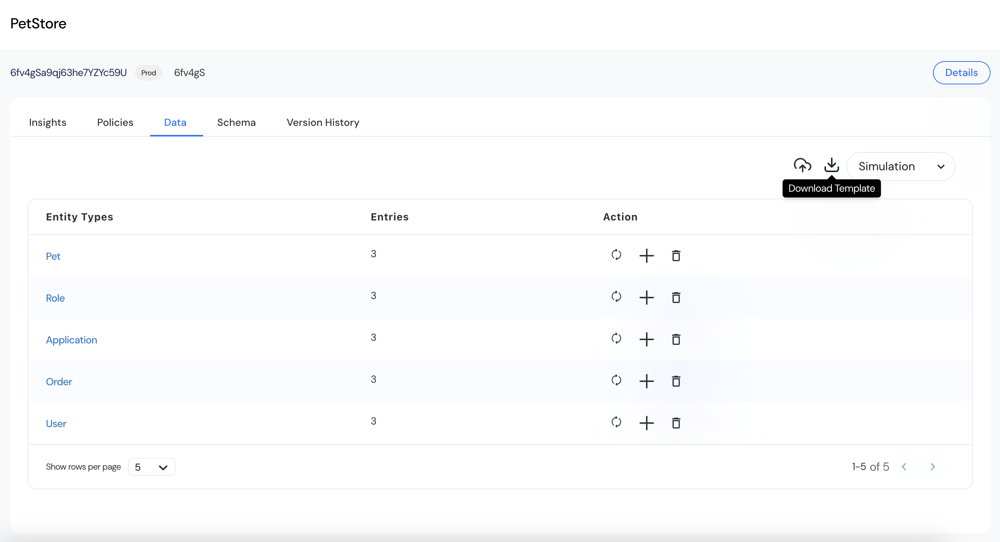

Test data is the foundation for simulating real-world access scenarios during policy testing. Reva simplifies test data preparation through schema-driven templates and flexible upload options.  

## Schema-Driven Templates
1. Entity types (e.g., User, Role, Pet, Order, Application) are automatically generated from the uploaded schema.  
2. Templates ensure correct column headers, required fields, and relationships between entities.  
3. Use the Download Template option to retrieve CSV templates for each entity type.  
     
<Info>Always download fresh templates after schema updates to ensure consistency.</Info>

## Prepare Test Data
1. Populate each CSV file with relevant test scenarios.  
2. Include both expected "Allow" and "Deny" access situations.  
3. Combine all CSV files into a single ZIP archive for upload.  

### Sample Test Data: PetStore Application
The test data follows Reva schema-driven structure where each entity type corresponds to one CSV file. The data simulates real-world access scenarios to validate policy behavior during simulation.  
Extract the File Structure from PetStore  

| File Name         | Entity Type |
|:----------------- |:----------- |
| `User.csv`        | User        |
| `Role.csv`        | Role        |
| `Application.csv` | Application |
| `Order.csv`       | Order       |
| `Pet.csv`         | Pet         |

**User.csv**
-  id — Represents the user identifier (Principal).  
-  memberOf:Role — Defines the role assigned to the user.  
   | id    | memberOf\:Role |
   |:----- |:-------------- |
   | Alice | Customer       |
   | John  | Owner          |
   | Jason | Emploee        |

**Role.csv**
-  id — Represents the unique identifier of each role.  
   | id       |
   |:-------- |
   | Customer |
   | Owner    |
   | Employee |

**Pet.csv**
-  id — Represents the valid enumeration values for pet type.
   | id     |
   | ------ |
   | Dog    |
   | Cat    |
   | Parrot |

**Order.csv**
-  id — Unique identifier for each Pet.
-  owner — User assigned as the owner of the Pet.
   | id (Pet ID) | owner (User ID) |
   |:----------- |:--------------- |
   | 123         | Alice           |
   | 456         | Alice           |
   | 789         | Alice           |

**Application.csv**
-  id — Unique identifier.
   | id     |
   | ------ |
   | PetStore    |
   | Order    |
   | Pet |

## Upload Methods
Test data can be uploaded at two stages:

1. During Application Onboarding  
   - Navigate to Step 4: Upload Test Data in the onboarding flow.  
   - Drop or browse to select your prepared ZIP file.  
   - Use Preview to validate the uploaded data before submission.  
2. From Policy Store (Post-Onboarding)
   - Navigate to the Policy Store → Data tab.  
   - Click Upload File.  
   - Drop or browse to select the ZIP file.  
   - Submit for simulation.  

## Data Management Actions in Policy Store

| Action  | Description                         |
|:--------|:-------------------------------------|
| **Upload**  | Upload new test data ZIP file       |
| **Replace** | Replace existing data for an entity |
| **Append**  | Add additional data entries         |
| **Delete**  | Remove entity data                  |
| **Refresh** | Reload current data                 |

