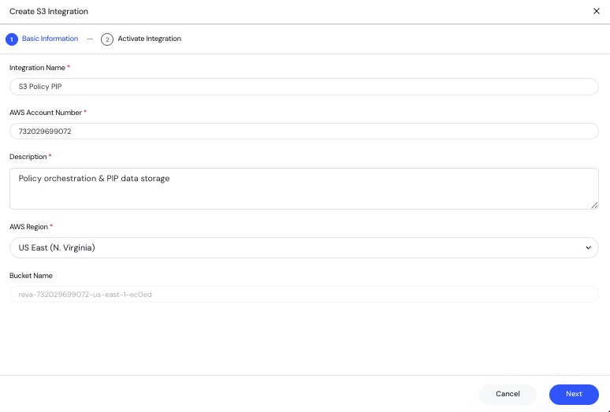

Reva supports seamless integration with Amazon S3 to enable cloud-native storage for Policy Information Point (PIP) data. This integration allows secure and scalable storage for policies and metadata necessary for policy orchestration.  

## Prerequisites
To run the CloudFormation Template (CFT), you need permissions for:  
1. Create IAM role for Reva to access S3 Bucket.  
2. Creates S3 Bucket for this Integration.  

## Integration Steps
1. Start AWS Integration  
   - → In Reva: Integrations > ”+ Integration” > Select “S3”
     
2. Configure Settings  
   - **Name:** (e.g., “S3 Policy PIP”)  
   - **AWS Account:** 12-digit ID (e.g., 214899999999)  
   - **Description:** (e.g., “Policy orchestration & PIP data storage”)  
   - **Region:** (e.g., US East (N. Virginia))  
   - **Bucket Name:** Auto-generated and read-only.
3. Click Next to proceed.  
4. Download CloudFormation Template (CFT) using the CFT button provided.  
5. Save Draft  
   - → Review settings before activating  
5. Deploy CloudFormation Template (CFT)  
6. Run the CFT in your AWS Console using the provided AWS Account Number and Region.  
The CloudFormation Template performs:  
   - Creation of an IAM role for Reva to access the S3 Bucket.  
   - Creation of the S3 bucket (no manual bucket setup needed).  
7. Confirm the template has been run by checking the “I confirm that CFT has been run” checkbox.    
8. Click Activate to complete the integration.  
   - → Status changes from Draft → Enabled  
