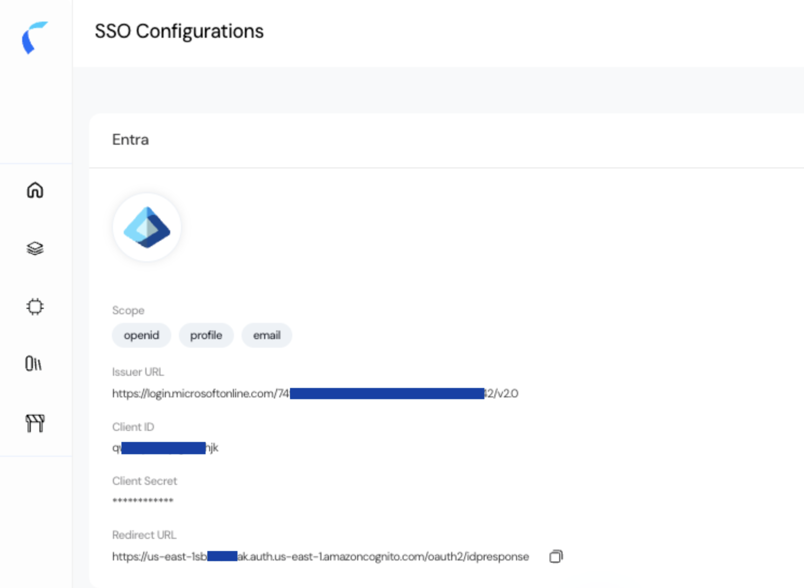

The Single Sign-On (SSO) Configurations page allows administrators to connect their organization’s identity provider (IdP) with Reva. By integrating SSO, users can log in securely using their existing enterprise credentials instead of creating separate accounts, ensuring a unified and secure authentication experience.  
## Key Features  
1. **Centralized Authentication:** Users authenticate through your enterprise identity provider (Microsoft Entra ID or Okta).  
2. **Seamless User Experience:** No need for multiple usernames or passwords.   
3. **Flexible Provider Support:** Currently supports Microsoft Entra ID and Okta with simple configuration steps.  
## Configuration Steps  
1. **Navigate to SSO Configurations**  
   From the left sidebar, go to Settings → SSO Configurations.  
   Choose a provider type: **Microsoft Entra** or **Okta**.  
2. **Select Provider**  
   Click on the desired provider tile to begin setup.
3. **Enter Provider Details**  
   Fill out the required fields:  
   - **Provider Name:** A descriptive name for your SSO configuration (e.g., "Org Entra SSO").
   - **Issuer URL:** The URL provided by your IdP that identifies the authorization server.
   - **Client ID:** Unique identifier generated by your IdP for Reva.
   - **Client Secret:** Secure secret issued by the IdP to authenticate Reva.
   - **Scope:** Defines what information is requested from the IdP (e.g., openid, profile, email, groups).
   <Info>  
   **Example: Microsoft Entra SSO Configuration**
   | Field             | Value                                                                 |
   |-------------------|----------------------------------------------------------------------|
   | **Provider Name** | Reva Okta Integration                                                |
   | **Issuer URL**    | `https://dev-123456.okta.com/oauth2/default`                         |
   | **Client ID**     | `0oa1xyz123ABCdEfG5d6`                                               |
   | **Client Secret** | `****`                                                              |
   | **Scope**         | `openid, profile, email, groups`                                    |  
    </Info>  
4. **Save the Configuration**  
   Click **Create** to complete the setup.  
   The provider will now be available for authentication.  
5. **Verify and Register Redirect URL**  
   Once the SSO configuration is created, you will see a summary page with the entered details and an auto-generated Redirect URL.  
   This Redirect URL must be copied and added to your Identity Provider (Microsoft Entra or Okta) under the application settings, usually in the Redirect URIs / Callback URLs section.  
   
   <Info>If this step is skipped, authentication attempts will fail because the IdP will not know where to send the authorization response.</Info> 
    **Example (Microsoft Entra**  
    <Info> 
    **Redirect URL Registration**
    In Azure Active Directory (App Registration):
    - Go to your registered application.
    - Navigate to Authentication → Redirect URIs.
    - Add the Redirect URL that ws generated from your Reva SSO configuration.
    - Save the changes.
    </Info>  

