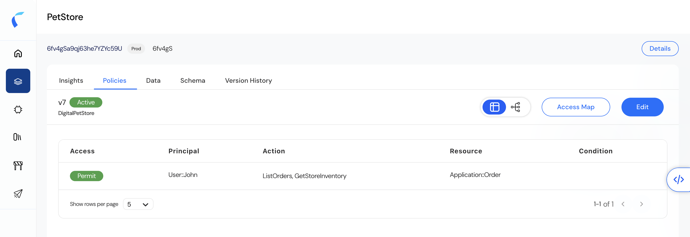
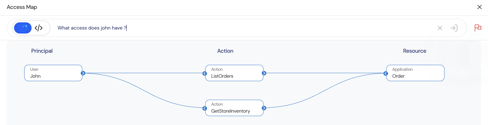

The Access Map is a visual tool that simplifies policy governance by presenting a clear, interactive view of effective permissions. It helps administrators, security teams, and auditors easily verify and analyze who has access to what, under which policies.  
By using Access Map, teams can:  
- Validate policies before deployment.  
- Detect misconfigurations and over-permissions.  
- Simplify compliance audits.  
- Continuously monitor effective access.  

## How to navigate to Access Map
To open Access Map:  
1. Navigate to Policy Store (e.g., PetStore).  
2. Click on the Policies tab.  
3. Click on the Access Map button located next to the Edit button.
     

## Query Policies for Governance
 

<Note>
    Query Access Map: *What access does John have?*
</Note>

 

| Access | Principal  | Action                        | Resource           |
| ------ | ---------- | ----------------------------- | ------------------ |
| Permit | User::John | ListOrders, GetStoreInventory | Application::Order |

This policy grants John permission to ListOrders and GetStoreInventory on Order resources in the application.

The Access Map will visually reflect this permission path to help you review and govern access effectively.

## Benefits of Access Map
| Benefit                        | Description                                                                     |
| ------------------------------ | ------------------------------------------------------------------------------- |
| **Full Visibility**            | View actual access granted by active policies.                                  |
| **Policy Simulation**          | Evaluate changes in a simulated environment before applying them to production. |
| **Misconfiguration Detection** | Instantly identify unintended access paths and over-provisioned users.          |
| **Compliance Audit Support**   | Generate visual evidence of access relationships for governance reports.        |

## Access Map Elements
| Component           | Description                                                |
| ------------------- | ---------------------------------------------------------- |
| **Principal Nodes** | Represent users, roles, or groups.                         |
| **Resource Nodes**  | Represent the resources or objects governed by the policy. |
| **Actions**         | Operations permitted on each resource.                     |

## Governance Best Practices
1. Perform regular Access Map reviews for critical applications.  
2. Use simulations prior to publishing any policy changes.  
3. Include Access Map outputs in governance documentation.  
4. Integrate Access Map analysis into quarterly security reviews.  

<Info>With Access Map, Reva simplifies policy governance by combining visibility, validation, and compliance into one actionable interface.</Info>